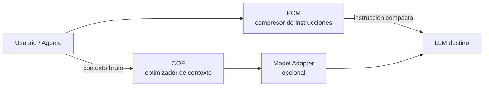
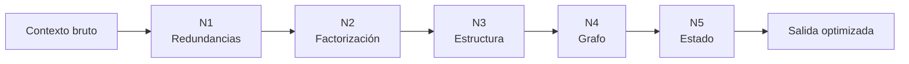

# Diseño global de alto nivel — COE

> Documento de arquitectura de **este repositorio**. La motivación, los niveles de optimización y CIR como concepto están en el [documento fundacional](Context%20Optimization%20Engine%20(COE).md). Aquí se describe **cómo lo implementamos**: piezas, responsabilidades y relaciones.

## 1. Propósito

COE es un **compilador de contexto**: recibe información heterogénea (RAG, historial, herramientas, código…) y produce una representación más compacta orientada al LLM, **sin resumir ni eliminar información necesaria**.

Analogía:

```
Texto / JSON / logs  →  [COE]  →  Contexto optimizado  →  LLM
     (fuentes)           IR +         (menos tokens,           (inferencia)
                      optimizadores    misma semántica)
```

---

## 2. Posición en el ecosistema

COE no sustituye a PCM; lo complementa en el pipeline de una petición:



| Componente | Repo | Entrada | Salida |
|------------|------|---------|--------|
| **PCM** | [Prompt-Compression-Middleware](https://github.com/ntnglz/Prompt-Compression-Middleware) | Prompt en lenguaje natural | Instrucción compacta (`TASK=…`) |
| **COE** | este repo | Bloques de contexto | Contexto optimizado |
| **Model Adapter** | futuro / externo | Contexto optimizado | Formato preferido del modelo |

PCM y COE pueden usarse de forma independiente. El pipeline completo maximiza el ahorro cuando conviven.

---

## 3. Piezas principales

COE se organiza en **capas** con interfaces claras. Cada pieza tiene una responsabilidad única.


### 3.1 Tabla de piezas

| Pieza | Responsabilidad | Entrada | Salida | Estado |
|-------|-----------------|---------|--------|--------|
| **Gateway** | Punto de entrada unificado (librería, CLI, MCP, HTTP futuro) | Petición del cliente | Contexto optimizado + métricas | Parcial (`run.py`) |
| **Context Ingest** | Normalizar fuentes heterogéneas a un modelo común; opcional **L0** idioma | Texto, chunks RAG, tool output, etc. | `ContextBundle` / `ContextBlock[]` | Parcial (`ContextBlock`) |
| **L0 (Language norm.)** | Detectar idioma; traducir a `target_lang` **antes de N1** si hace falta | `ContextBlock[]` | `ContextBlock[]` en idioma base | Spec: [l0-ingest.md](l0-ingest.md) |
| **Normalizer** | Partir contenido en unidades comparables (líneas, párrafos, nodos) | Bloques crudos | Unidades normalizadas | Parcial (dentro de N1) |
| **Optimization Pipeline** | Aplicar niveles de optimización en cadena configurable | Unidades + metadatos | Estructura optimizada | N1 ✅, N2–N5 planificado |
| **CIR** | Representación intermedia estable, optimizable y serializable | Salida de parser / pipeline | Árbol o grafo de contexto | Diseño (sin implementar) |
| **Renderer** | Convertir resultado interno a texto o JSON para el LLM | Resultado del pipeline | String / messages[] | Parcial (`level1/render.py`) |
| **Metrics** | Tokens, ratio, latencia, integridad semántica | Antes / después del pipeline | Informe de métricas | Parcial (estimación tokens) |
| **State Store** | Mantener estado semántico entre turnos (Nivel 5) | Diffs de contexto | Vista materializada | Futuro |

---

## 4. Relaciones entre piezas

### 4.1 Flujo principal (happy path)

1. **Gateway** recibe contexto bruto y opciones (`target_lang`, `locale`, `levels=[1,2]`, presupuesto de tokens).
2. **Context Ingest** asigna `id`, `source_type` y metadatos a cada bloque.
3. **L0** (opcional) detecta idioma y traduce a `target_lang` sobre prosa natural — ver [l0-ingest.md](l0-ingest.md), [i18n.md](i18n.md).
4. **Normalizer** prepara unidades atómicas para el pipeline (hoy: líneas; otros locales en packs).
5. **Optimization Pipeline** ejecuta niveles habilitados en orden creciente de complejidad.
5. En fases avanzadas, el pipeline lee/escribe **CIR** como artefacto central.
6. **Renderer** materializa la salida en formato legible por el LLM.
7. **Metrics** compara entrada y salida y adjunta el informe al Gateway.

### 4.2 Dependencias

```
Gateway
  └── Context Ingest
        └── L0 Language normalization (opcional) → [l0-ingest.md](l0-ingest.md)
        └── Normalizer
              └── Optimization Pipeline
                    ├── Level 1 (deduplicación)
                    ├── Level 2 (factorización)
                    ├── Level 3 (estructuración)
                    ├── Level 4 (grafo)
                    └── Level 5 (estado) ← State Store
              └── CIR (objetivo: contrato entre niveles)
        └── Renderer
  └── Metrics (observa todo el flujo)
```

- **CIR** será el contrato interno: cada nivel transforma CIR → CIR optimizado.
- **Renderer** es independiente del nivel concreto: consume el CIR final (o el resultado del último nivel disponible).
- **Metrics** no modifica datos; es transversal (observabilidad + benchmarks).
- **State Store** solo interviene en Nivel 5; los niveles 1–4 son stateless sobre el bundle de entrada.

### 4.3 Qué NO hace COE

| Fuera de alcance | Dónde vive |
|------------------|------------|
| Comprimir instrucciones del usuario | PCM |
| Elegir qué documentos recuperar (retrieval) | Sistema RAG / agente |
| Inferencia del LLM | Cliente upstream |
| Resumir eliminando información | Explícitamente rechazado por diseño |

---

## 5. Pipeline de optimización (niveles)

Los [cinco niveles](Context%20Optimization%20Engine%20(COE).md#niveles-de-optimización) son **etapas composables**, no modos excluyentes.



| Nivel | Transformación | Tipo | Implementación COE |
|-------|------------------|------|-------------------|
| **1** | Extraer duplicados exactos inter-bloque | Determinista | `src/coe/level1/` ✅ |
| **2** | Agrupar hechos bajo entidades (`Juan → acciones`) | Heurística + locale pack | Spec ✅ [level2.md](level2.md) |
| **3** | Natural → estructura compacta (`entity{…}`) | Parser / plantillas | Planificado |
| **4** | Mantener grafo de conocimiento incremental | Grafo + consultas | Investigación |
| **5** | Estado semántico + diff (modelo Git) | Store persistente | Investigación |

**Regla de composición:** cada nivel asume que el anterior ya eliminó la redundancia obvia de su capa. Se pueden activar subconjuntos (p. ej. solo N1, o N1+N2).

Specs operativas: [levels.md](levels.md) · [level1.md](level1.md) ✅ · [level2.md](level2.md) ✅ · [level3.md](level3.md)–[level5.md](level5.md)

---

## 6. Modelo de datos (visión)

Evolución prevista del modelo interno:

```
ContextBundle
├── blocks: ContextBlock[]
│     ├── id: str
│     ├── source_type: rag | history | tool | code | memory
│     ├── content: str
│     ├── detected_lang: str | None    # post-L0
│     └── metadata: dict
├── target_lang: str | None            # L0: en, zh, …
├── locale: str | None                 # locale pack N2+ (en, zh, …)
├── query_context: str | None
└── options: OptimizeOptions

OptimizeResult
├── optimized_text: str
├── cir: CIR | None                # cuando exista
├── shared_facts: SharedFact[]     # N1
├── metrics: OptimizationMetrics
└── trace: LevelTrace[]            # depuración por nivel
```

Hoy solo existen `ContextBlock`, `SharedFact` y `DeduplicationResult` (`src/coe/models.py`). El resto se introducirá al integrar Gateway + CIR.

---

## 7. Interfaces previstas

### 7.1 Librería (actual y objetivo)

```python
# Hoy
from coe.level1 import deduplicate_context

# Objetivo
from coe import optimize_context

result = optimize_context(
    blocks=[...],
    target_lang="en",      # L0: normalizar idioma antes de N1
    locale="en",           # patrones N2+ (locale pack)
    levels=[1, 2],
    target_model="mistral-large",
)
result.text          # para el LLM
result.metrics       # ahorro, latencia
result.to_json()     # pipelines / logs
```

### 7.2 Servicios (futuro)

| Interfaz | Uso |
|----------|-----|
| **CLI** | `run.py --demo`, benchmarks locales |
| **MCP** | Herramientas `optimize_context`, `estimate_savings` para agentes |
| **HTTP** | Middleware transparente en pipelines RAG |

PCM ya expone MCP/HTTP para compresión; COE seguirá el mismo patrón de integración cuando el pipeline esté maduro.

---

## 8. Métricas y calidad

Transversal a todo el diseño:

| Métrica | Uso |
|---------|-----|
| **Ratio de compresión** | Decidir si optimizar vale la pena |
| **Tokens ahorrados** | ROI económico |
| **Latencia del pipeline** | Límite aceptable vs. ahorro |
| **Integridad (N1–N3)** | Toda la información original debe ser reconstruible |
| **Calidad de respuesta (E2E)** | LLM judge con contexto original vs. optimizado |

Los benchmarks vivirán en `data/` + `tests/` + scripts dedicados (por crear).

---

## 9. Roadmap de implementación por bloques

Orden sugerido para construir las piezas:

| Fase | Bloques | Entregable |
|------|---------|------------|
| **A** ✅ | Ingest mínimo + N1 + Renderer + Metrics básicas | Prototipo deduplicación |
| **B** | Gateway unificado (`optimize_context`) + tests de integración | API estable N1 |
| **C** | N2 factorización + ampliación de `ContextBlock` | Pipeline N1+N2 |
| **D** | Esbozo CIR + refactor pipeline sobre CIR | Contrato interno |
| **E** | MCP + benchmark RAG | Integración agentes |
| **F** | N3–N5 + State Store | Investigación |

---

## 10. Principios de diseño

1. **Sin pérdida en niveles tempranos** — N1 y N2 reorganizan; no resumen.
2. **Composición** — Niveles independientes, activables por configuración.
3. **Determinismo primero** — heurísticas exactas antes de LLM auxiliar.
4. **Separación PCM / COE** — visión fundacional aquí, compresión de instrucciones en PCM; repos independientes.
5. **Observabilidad** — cada nivel reporta qué cambió (`trace`).
6. **Renderer desacoplado** — el LLM no impone la estructura interna.

---

## 11. Documentos relacionados

| Documento | Contenido |
|-----------|-----------|
| [vision.md](vision.md) | Índice de documentación |
| [Context Optimization Engine (COE).md](Context%20Optimization%20Engine%20(COE).md) | Visión fundacional (canónica) |
| [levels.md](levels.md) | Pipeline L0 → N1–N5: contratos e integración |
| [i18n.md](i18n.md) | Principios multilingües, locale packs, `target_lang` |
| [l0-ingest.md](l0-ingest.md) | Spec L0 — normalización de idioma (pre-N1) |
| [level1.md](level1.md) – [level5.md](level5.md) | Spec operativa por nivel |
