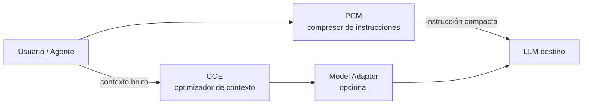
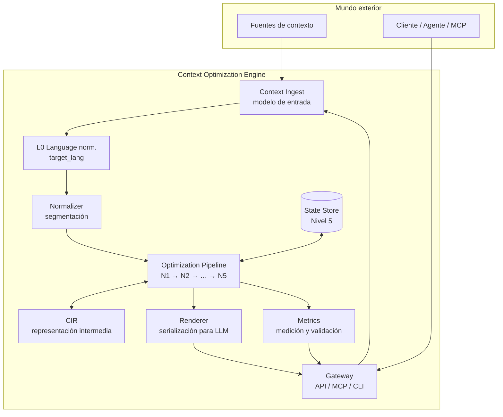
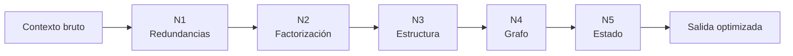

# Diseño global de alto nivel — COE

> Documento de arquitectura de **este repositorio**. La motivación, los niveles de optimización y CIR como concepto están en el [documento fundacional](Context%20Optimization%20Engine%20(COE).md). Aquí se describe **cómo lo implementamos**: piezas, responsabilidades y relaciones.

## 1. Propósito

COE es un **compilador de contexto**: recibe información heterogénea (RAG, historial, herramientas, código…) y produce una representación más compacta orientada al LLM, **sin resumir ni eliminar información necesaria**.

Analogía:

```
Texto / JSON / logs  →  [COE]  →  Contexto optimizado  →  LLM
     (fuentes)           IR +         (menos tokens,           (inferencia)
                      optimizadores    misma semántica)
```

---

## 2. Posición en el ecosistema

COE no sustituye a PCM; lo complementa en el pipeline de una petición:



| Componente | Repo | Entrada | Salida |
|------------|------|---------|--------|
| **PCM** | [Prompt-Compression-Middleware](https://github.com/ntnglz/Prompt-Compression-Middleware) | Prompt en lenguaje natural | Instrucción compacta (`TASK=…`) |
| **COE** | este repo | Bloques de contexto | Contexto optimizado |
| **Model Adapter** | post-renderer opcional | Contexto optimizado | Formato preferido del modelo | ✅ `src/coe/model_adapter/` |

PCM y COE pueden usarse de forma independiente. El pipeline completo maximiza el ahorro cuando conviven.

### 3.4 Model Adapter (acotado)

Componente **opcional** post-Renderer (Gateway aplica tras truncado de presupuesto):

| Hace | No hace |
|------|---------|
| Ajustar formato al gusto del modelo (markdown, bullets, marcadores instruct) | Traducir idioma (L0) |
| Resolver adaptador por `target_model` (`mistral-*`, `gpt-*`, …) | Cambiar hechos ni omitir contenido |
| Trazas en `metrics.model_adapter` y `latency_ms_by_level.model_adapter` | Sustituir benchmarks de comprensión |

Adaptadores registrados: `default` (passthrough), `mistral` (`[SECTION]`, `[AVAILABLE CONTEXT]`), `openai` (`##` + `<optimized_context>`).

```python
result = optimize_context(blocks, levels=[1, 2], target_model="gpt-4o")
result.metrics.model_adapter  # "openai"
```

---

## 3. Piezas principales

COE se organiza en **capas** con interfaces claras. Cada pieza tiene una responsabilidad única.



### 3.1 Tabla de piezas

| Pieza | Responsabilidad | Entrada | Salida | Estado |
|-------|-----------------|---------|--------|--------|
| **Gateway** | Punto de entrada unificado (librería, CLI, MCP, HTTP) | Petición del cliente | Contexto optimizado + métricas | ✅ `optimize_context` (L0, N1–N5) |
| **Context Ingest** | Normalizar fuentes heterogéneas a un modelo común; Normalizer; opcional **L0** | Texto, chunks RAG, tool output, etc. | `ContextBundle` / `ContextBlock[]` | v1 · `ingest_context` · `src/coe/ingest/` |
| **L0 (Language norm.)** | Detectar idioma; traducir a `target_lang` **antes de N1** si hace falta | `ContextBlock[]` | `ContextBlock[]` en idioma base | v1 [l0-ingest.md](l0-ingest.md) · `src/coe/ingest/` |
| **Normalizer** | Sub-etapa de Ingest: segmentación (líneas, oraciones `zh`), respeto fences | Bloques crudos | Unidades normalizadas | ✅ v1 · `ingest/normalizer.py` |
| **Optimization Pipeline** | Aplicar niveles de optimización en cadena configurable | Unidades + metadatos | Estructura optimizada | N1–N5 ✅ |
| **CIR** | Representación intermedia estable del grafo N4+ | Salida N4 / N5 | Envelope `cir_version` + `graph` | ✅ v1.0 · [cir-v1.md](cir-v1.md) · `src/coe/cir/` |
| **Renderer** | Proyección **prosa** hacia LLM; ensamblaje final | Resultado del pipeline | String / messages[] | ✅ · `renderer/assembly.py` |
| **Metrics** | Tokens, ratio, latencia, integridad semántica | Antes / después del pipeline | Informe de métricas | Gateway + harness |
| **State Store** | Mantener estado semántico entre turnos (Nivel 5) | Diffs de contexto | Vista materializada | v1 filesystem JSON + in-memory · `src/coe/level5/` |

---

## 4. Relaciones entre piezas

### 4.1 Flujo principal (happy path)

1. **Gateway** recibe contexto bruto y opciones (`target_lang`, `locale`, `levels=[1,2]`, presupuesto de tokens).
2. **Context Ingest** asigna `id`, `source_type` y metadatos a cada bloque.
3. **L0** (opcional) detecta idioma y traduce a `target_lang` sobre prosa natural — ver [l0-ingest.md](l0-ingest.md), [i18n.md](i18n.md).
4. **Normalizer** prepara unidades atómicas (sub-etapa Ingest) — ver [ingest.md](ingest.md).
5. **Optimization Pipeline** ejecuta niveles habilitados en orden creciente de complejidad.
6. El pipeline materializa y persiste **CIR v1.0** (grafo N4+) — ver [cir-v1.md](cir-v1.md).
7. **Renderer** materializa **prosa** para el LLM — ver [renderer.md](renderer.md).
8. **Metrics** compara entrada y salida y adjunta el informe al Gateway.

### 4.2 Dependencias

```
Gateway
  └── Context Ingest
        └── L0 Language normalization (opcional) → [l0-ingest.md](l0-ingest.md)
        └── Normalizer
              └── Optimization Pipeline
                    ├── Level 1 (deduplicación)
                    ├── Level 2 (factorización)
                    ├── Level 3 (estructuración)
                    ├── Level 4 (grafo)
                    └── Level 5 (estado) ← State Store
              └── CIR (objetivo: contrato entre niveles)
        └── Renderer
  └── Metrics (observa todo el flujo)
```

- **CIR v1.0** (Fase 6 ✅): solo el grafo N4+ se versiona y persiste; N1–N3 permanecen lowering en Python — [cir-v1.md](cir-v1.md). Pipeline: `DeduplicationResult` → … → `ContextGraph` → envelope N5.
- **Renderer** consume la salida del último nivel activo y produce **prosa** — [renderer.md](renderer.md).
- **Metrics** no modifica datos; es transversal (observabilidad + benchmarks).
- **State Store** solo interviene en Nivel 5; los niveles 1–4 son stateless sobre el bundle de entrada.

### 4.3 Qué NO hace COE

| Fuera de alcance | Dónde vive |
|------------------|------------|
| Comprimir instrucciones del usuario | PCM |
| Elegir qué documentos recuperar (retrieval) | Sistema RAG / agente |
| Inferencia del LLM | Cliente upstream |
| Resumir eliminando información | Explícitamente rechazado por diseño |

### 4.4 Composición PCM + COE (Fase 11 ✅)

Pipeline compuesto para el turno completo hacia el LLM:

```python
from coe import optimize_with_pcm

result = optimize_with_pcm(
    blocks=[...],
    user_instruction="Who works at ACME?",
    levels=[1, 2],
    locale="en",
    max_window_tokens=8192,   # reparto ventana
    response_reserve=512,     # reserva respuesta
    pcm_backend="stub",         # CI: stub · prod: "ollama"
)
# result.instruction.compressed → TASK=… (PCM)
# result.context.text           → contexto COE optimizado
# result.messages               → messages[] listos para el LLM
```

| Pieza | Repo | Rol |
|-------|------|-----|
| **PCM** | `../Prompt Compression Middleware` | Comprime **instrucción** del usuario |
| **COE** | este repo | Optimiza **contexto** con `max_context_tokens` derivado de la ventana |

Reparto de ventana: `coe_budget = max_window_tokens − instruction_tokens − response_reserve`.

Backends PCM: **`stub`** (determinista, CI) · **`ollama`** (``pcm.PromptCompressor`` vía `PCM_ROOT`).

Harness: perfil `coe_pcm_n1_en` · modo `composition: coe+pcm` · ver [benchmark-harness.md](benchmark-harness.md).

---

## 5. Pipeline de optimización (niveles)

Los [cinco niveles](Context%20Optimization%20Engine%20(COE).md#niveles-de-optimización) son **etapas composables**, no modos excluyentes.



| Nivel | Transformación | Tipo | Implementación COE |
|-------|------------------|------|-------------------|
| **1** | Extraer duplicados exactos inter-bloque | Determinista | `src/coe/level1/` ✅ |
| **2** | Agrupar hechos bajo entidades (`Juan → acciones`) | Heurística + locale pack | `src/coe/level2/` ✅ v1 |
| **3** | Natural → estructura compacta + `render_prose()` | Parser / plantillas + proyección LN | `src/coe/level3/` v1 · [level3.md](level3.md) |
| **4** | Grafo del bundle + `render_prose()` | Topológico; cero pérdida vs N3 | `src/coe/level4/` v1 · [level4.md](level4.md) |
| **5** | Estado semántico + diff (modelo Git) | Store persistente | `src/coe/level5/` v1 · [level5.md](level5.md) |

**Regla de composición:** cada nivel asume que el anterior ya eliminó la redundancia obvia de su capa. Se pueden activar subconjuntos (p. ej. solo N1, o N1+N2).

Specs operativas: [levels.md](levels.md) · [level1.md](level1.md) ✅ · [level2.md](level2.md) ✅ · [level3.md](level3.md) ✅ · [level4.md](level4.md) ✅ · [level5.md](level5.md)

---

## 6. Modelo de datos

Implementado en `src/coe/models.py`, `ingest/types.py` y resultados del Gateway:

```
ContextBundle / ContextBlock[]
├── id, content, source_type
├── detected_lang, metadata (preserve_lang, source_uri, …)
├── target_lang, locale, query_context, session_id
└── options: IngestOptions (max_context_tokens, cite_sources, …)

OptimizeResult
├── text                    # prosa hacia el LLM
├── metrics                 # tokens, latencia, truncated, …
├── trace                   # LevelTrace[] por nivel
├── deduplication, factorization, structured, graph  # según levels
└── ingest_trace            # si L0 activo
```

CIR v1.0: grafo serializado en N5 (`SemanticState.graph` + envelope). Detalle: [cir-v1.md](cir-v1.md).

Guía de integración sin entrar en niveles: [getting-started.md](getting-started.md).

---

## 7. Interfaces previstas

### 7.1 Librería

```python
from coe import optimize_context, ingest_context
from coe.models import ContextBlock

result = optimize_context(
    blocks=[ContextBlock(id="A", content="...", source_type="rag")],
    target_lang="en",
    locale="en",
    levels=[1, 2],
    target_model="mistral-large",
)
result.text       # prosa para el LLM
result.metrics    # tokens, latencia
```

Tutorial: [getting-started.md](getting-started.md). Configuración MCP/HTTP en §7.2–7.3 (enlaces, no duplicar aquí).

### 7.2 Servicios (MCP)

| Interfaz | Uso |
|----------|-----|
| **CLI** | `run.py --demo`, benchmarks locales |
| **MCP** | Herramientas `optimize_context`, `estimate_savings` para agentes |
| **HTTP** | `POST /optimize`, `POST /estimate`, `GET /health` | ✅ `scripts/http/run_server.py` |

#### MCP COE (stdio)

Ver [getting-started.md § MCP](getting-started.md#mcp-cursor-claude-desktop) para configuración Cursor y payload de ejemplo.

Servidor en `src/coe/mcp/`; arranque:

```bash
python scripts/mcp/run_server.py
# o desde el repo con PYTHONPATH=src:
python -m coe.mcp.server
```

Configuración Cursor (`.cursor/mcp.json` o ajustes MCP):

```json
{
  "mcpServers": {
    "coe": {
      "command": "python",
      "args": ["/ruta/al/Context-Optimization-Engine/scripts/mcp/run_server.py"],
      "env": {}
    }
  }
}
```

**`optimize_context`** — entrada: lista de bloques `{id, content, source_type?}` + opciones (`levels`, `locale`, `l0`, `session_id`, …). Salida: JSON con `text` (prosa hacia el LLM) y `metrics`.

```json
{
  "blocks": [
    {"id": "A", "source_type": "rag", "content": "Empresa: ACME\nJuan works at ACME."},
    {"id": "B", "source_type": "rag", "content": "Empresa: ACME\nPresupuesto: 50k"}
  ],
  "levels": [1, 2],
  "locale": "en"
}
```

**`estimate_savings`** — mismas opciones; devuelve solo métricas (`original_tokens`, `optimized_tokens`, `tokens_saved`, `compression_ratio`, `latency_ms`) sin prosa y sin evaluador LLM.

Dependencia: `pip install -r requirements-mcp.txt` (incluye `mcp`).

### 7.3 HTTP API

Ver [getting-started.md § HTTP](getting-started.md#http-api) para `curl` y ejemplos en `data/examples/`.

Servidor en `src/coe/http/`; arranque:

```bash
pip install -r requirements-http.txt
python scripts/http/run_server.py
# default http://127.0.0.1:8080
```

**`GET /health`** — liveness.

**`POST /optimize`** — mismo cuerpo JSON que MCP `optimize_context`. Respuesta JSON con `text` + `metrics`.

**`POST /estimate`** — paridad con MCP `estimate_savings` (métricas sin prosa).

```bash
curl -s http://127.0.0.1:8080/health

curl -s -X POST http://127.0.0.1:8080/optimize \
  -H "Content-Type: application/json" \
  -d '{
    "blocks": [
      {"id": "A", "source_type": "rag", "content": "Empresa: ACME\nJuan works at ACME."},
      {"id": "B", "source_type": "rag", "content": "Empresa: ACME\nPresupuesto: 50k"}
    ],
    "levels": [1, 2],
    "locale": "en"
  }'

curl -s -X POST http://127.0.0.1:8080/estimate \
  -H "Content-Type: application/json" \
  -d '{"blocks": [{"id": "A", "content": "Empresa: ACME"}], "levels": [1]}'
```

Dependencia: `pip install -r requirements-http.txt` (`fastapi`, `uvicorn`).

PCM ya expone MCP/HTTP para compresión; COE sigue el mismo patrón de integración stdio (MCP) y HTTP para despliegue RAG.

---

## 8. Métricas y calidad

Transversal a todo el diseño. **Especificación completa:** [benchmarks.md](benchmarks.md).

| Métrica | Uso |
|---------|-----|
| **Ratio de compresión** | Documentado; no bloquea si fallan KPIs de calidad |
| **Tokens ahorrados** | ROI económico |
| **`t_coe` (latencia COE)** | P95 ≤ **200 ms** (L0+N1–N4 chat); ≤ **350 ms** con N5; ver presupuestos por etapa |
| **Integridad (N1–N4)** | Cero pérdida por nivel; N4: grafo ∪ orphans ⊇ entrada N3 |
| **Comprensión (N2–N5)** | `comprehension_similarity` ≥ 0,90; `factual_recall` ≥ 0,95 vs original pre-L0 |
| **Redacción E2E** | `readability_score` ≥ 3,5; `artifact_leak_rate` ≤ 2%; respuesta legible para usuario final |
| **Calidad de respuesta (E2E)** | Benchmark A/B: original crudo vs optimizado + juez LLM |

Los benchmarks vivirán en `data/` + `tests/` + `scripts/comprehension_benchmark.py` (por crear).

---

## 9. Roadmap de implementación

> **Fuente única de verdad del orden de trabajo:** [execution-plan.md](execution-plan.md)  
> Las fases A–F de abajo son **histórico**; el plan vigente usa Fases 0–18 — ver [execution-plan.md](execution-plan.md).

### Estado por bloques (foto 2026-07-05)

| Bloque | Contenido | Estado código |
|--------|-----------|---------------|
| **A** | Ingest mínimo + N1 + Renderer + Metrics | ✅ Fases 1–2 |
| **B** | Gateway `optimize_context` | ✅ L0, N1–N5 |
| **C** | N2 factorización | ✅ |
| **D** | CIR + refactor pipeline | ✅ Fase 6 |
| **E** | MCP + benchmark RAG | ✅ MCP + schema casos Fase 8 |
| **F** | N3–N5 + State Store | ✅ v1; escala Fases 14–16 |
| **G** | Integración despliegue | ✅ Fases 10–13 (tokens, PCM, HTTP, adapter) |
| **H** | i18n + ingest completo | ✅ Fases 17–18 |

### Orden vigente (resumen)

Ver [execution-plan.md](execution-plan.md) para entregables, criterios de hecho y reglas estrictas.

| Fase | Nombre | Estado |
|------|--------|--------|
| 0–5 | Núcleo v1 (Ingest → MCP) | ✅ |
| 6 | CIR formal | ✅ |
| 7 | Sincronización documental | ✅ |
| 8 | Harness contrato + corpus | ✅ |
| 9 | L0 v2 | ✅ |
| 10 | Presupuesto tokens COE | ✅ |
| 11 | Integración PCM+COE | ✅ |
| 12 | HTTP API | ✅ |
| 13 | Model Adapter | ✅ |
| 14 | N5 operaciones (TTL) | ✅ |
| 15 | Entity linking fuzzy | ✅ |
| 16 | Store distribuido | ✅ |
| 17 | Locale `zh` | ✅ |
| 18 | Ingest structured/code | ✅ |
| 19 | CIR v1.1 Opción B | 🚫 omitida |
| 20 | Docs visitante e integrador | ✅ |
| I | Investigación (ML, CIR→LLM) | sin fase |

### Histórico (fases A–F originales)

| Fase | Bloques | Entregable |
|------|---------|------------|
| **A** ✅ | Ingest mínimo + N1 + Renderer + Metrics básicas | Prototipo deduplicación |
| **B** ✅ | Gateway unificado (`optimize_context`) + tests de integración | API estable |
| **C** ✅ | N2 factorización + ampliación de `ContextBlock` | Pipeline N1+N2 |
| **D** ✅ | Esbozo CIR + refactor pipeline sobre CIR | Contrato interno CIR v1.0 |
| **E** ✅ | MCP + benchmark RAG | Integración agentes |
| **F** ✅ | N3–N5 + State Store | Pipeline completo v1 |

---

## 10. Principios de diseño

1. **Sin pérdida en niveles tempranos** — N1 y N2 reorganizan; no resumen.
2. **Composición** — Niveles independientes, activables por configuración.
3. **Determinismo primero** — heurísticas exactas antes de LLM auxiliar.
4. **Separación PCM / COE** — visión fundacional aquí, compresión de instrucciones en PCM; repos independientes.
5. **Observabilidad** — cada nivel reporta qué cambió (`trace`).
6. **Renderer desacoplado** — el LLM no impone la estructura interna.

---

## 11. Documentos relacionados

| Documento | Contenido |
|-----------|-----------|
| [vision.md](vision.md) | Índice de documentación |
| [Context Optimization Engine (COE).md](Context%20Optimization%20Engine%20(COE).md) | Visión fundacional (canónica) |
| [levels.md](levels.md) | Pipeline L0 → N1–N5: contratos e integración |
| [i18n.md](i18n.md) | Principios multilingües, locale packs ✅ aprobado |
| [benchmarks.md](benchmarks.md) | KPIs comprensión, redacción, latencia COE |
| [spec-gaps.md](spec-gaps.md) | Checklist cierre pre-implementación |
| [ingest.md](ingest.md) | Context Ingest + Normalizer |
| [renderer.md](renderer.md) | Prosa hacia LLM |
| [l0-ingest.md](l0-ingest.md) | Spec L0 — normalización de idioma (pre-N1) ✅ aprobada |
| [level1.md](level1.md) – [level5.md](level5.md) | Spec operativa por nivel |
