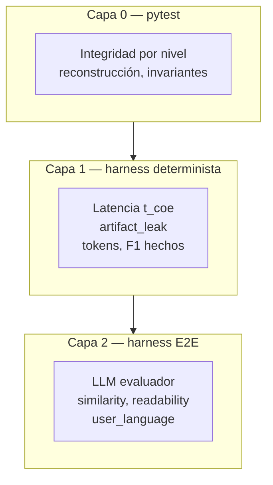

# Harness de benchmarks — diseño

> KPIs y umbrales: [benchmarks.md](benchmarks.md) · Pipeline COE: [levels.md](levels.md) · Render: [renderer.md](renderer.md)  
> Hermano conceptual: PCM `e2e_benchmark` (instrucción); COE mide **contexto**.

**Estado:** diseño aprobado para implementación · decisiones operativas cerradas (§15) · código pendiente

El harness no es un script auxiliar: es el **sistema de calidad** que validará cada nivel (N2→N5), cada cambio de locale pack y cada perfil de despliegue. Debe ser **rápido en CI**, **reproducible**, **barato** en volumen y **estricto** en pre-release.

---

## 1. Rol en el ecosistema COE + PCM

```
                    ┌─────────────────────────────────────┐
  Usuario           │  PCM (instrucción)  +  COE (contexto) │
                    └─────────────────────────────────────┘
                                      │
                                      ▼
                              LLM destino → respuesta

COE harness valida:  contexto crudo  vs  contexto optimizado  →  ¿misma utilidad?
PCM E2E valida:     prompt natural  vs  prompt comprimido   →  ¿misma utilidad?
```

| Proyecto | Qué comprime | Harness propio |
|----------|------------|----------------|
| **COE** | RAG, historial, tools, estado N5 | Este documento |
| **PCM** | Instrucción del usuario | `pcm.e2e_benchmark` |

Modos de composición (fase posterior):

| Modo | Uso |
|------|-----|
| **`coe-only`** (default v1) | Solo bloque contexto; instrucción fija en el caso |
| **`coe+pcm`** | Instrucción comprimida PCM + contexto COE — validación stack completa |
| **`structural-only`** | Sin LLM; integridad + latencia + artifacts |

El harness COE **no sustituye** tests unitarios (`tests/test_level*.py`); los **complementa**.

---

## 2. Tres capas (no mezclar)

Cada capa tiene propósito, coste y gate distinto.



| Capa | LLM | Coste | Cuándo | Exit code CI |
|------|-----|-------|--------|--------------|
| **0 — pytest** | No | ~segundos | Cada push | Obligatorio |
| **1 — determinista** | No | ~segundos–minutos | Cada push | Obligatorio (subset) |
| **2 — E2E** | Sí | Minutos–horas | Nightly / pre-release / manual | Gate release |

**Regla:** un fallo en capa 0 o 1 **no se compensa** con capa 2. Capa 2 no corre si capa 1 falla en el mismo perfil.

---

## 3. Flujo de un caso (corazón del harness)

Por cada **caso** × **perfil de pipeline**:

```
1. Cargar Case (dataset validado contra schema)
2. Construir brazo A — contexto crudo + system (response_lang) + pregunta
3. Ejecutar optimize_context(perfil) → brazo B context + metrics (t_coe, trace)
4. Capa 1: scorers deterministas sobre B (artifacts, F1, latencia, ratio)
5. Capa 2 (si habilitada):
     a. LLM evaluador → respuesta A
     b. Mismo evaluador → respuesta B
     c. Scorers E2E (similarity, readability, user_language)
6. Append CaseResult al Report
7. Al final: agregar summary, gate, escribir JSON + markdown
```

**Invariantes del experimento** (violación = caso inválido):

| # | Invariante |
|---|------------|
| 1 | Mismo **evaluador**, **temperatura**, **seed** (si aplica) en A y B |
| 2 | Misma **pregunta** y misma **system** (`response_lang`, tono PCM) |
| 3 | Solo cambia el **bloque de contexto** (crudo vs optimizado) |
| 4 | Brazo A = **pre-L0, pre-COE** (patrón oro) |
| 5 | Brazo B = salida **`render_prose()` / Renderer** — nunca estructura interna |

---

## 4. Layout del código

Separar **librería** (testeable sin red) de **CLI** (operación humana/CI).

```
src/coe/benchmark/
├── __init__.py
├── schema.py           # Case, CaseResult, PipelineProfile, Report, GateResult
├── dataset.py          # load, validate, filter by tags
├── profile.py          # YAML/JSON perfiles → OptimizeOptions
├── arms.py             # build_messages_arm_a / arm_b
├── runner.py           # run_case, run_suite
├── scorers/
│   ├── factual.py      # F1 sobre expected_facts (regex/span, sin LLM)
│   ├── artifacts.py    # artifact_leak_rate
│   ├── latency.py      # t_coe vs presupuesto perfil
│   ├── tokens.py       # prose_ratio, documentado
│   ├── embedding.py    # comprehension_similarity (opcional local model)
│   ├── readability.py  # juez LLM
│   └── language.py     # user_language_match (langdetect + heurística)
├── evaluators/
│   ├── base.py         # Protocol LLMEvaluator
│   ├── mock.py         # respuestas fixture → CI determinista
│   └── ollama.py       # local default
└── report.py           # JSON, markdown, compare_runs, gate

scripts/benchmark/
├── run.py              # CLI principal
└── compare.py          # diff dos report.json (regresión)

data/benchmarks/
├── schema/
│   └── case.schema.json
├── cases/              # un fichero por caso o por suite
│   ├── core/           # gate CI capa 1+2 subset
│   ├── single_turn/
│   ├── multi_turn/     # N5
│   ├── multilingual/
│   └── regression/     # fallos históricos congelados
├── profiles/
│   ├── n1.yaml
│   ├── n1_n2_en.yaml
│   ├── l0_n1_n4_en.yaml
│   └── n5_session.yaml
├── fixtures/           # mock evaluator: case_id → {arm_a, arm_b} text
└── runs/               # gitignored; salidas timestamped
    └── .gitkeep
```

Integración con `run.py` raíz (futuro):

```bash
python run.py --benchmark --profile n1_n2_en --tier ci
python run.py --benchmark --profile full --tier release --evaluator ollama:qwen3:8b
```

---

## 5. Schema de casos (`Case`)

Un caso es un experimento **respondible solo con el contexto**. Validación JSON Schema en carga.

```json
{
  "id": "acme_budget_v1",
  "version": 1,
  "tags": ["core", "single_turn", "en"],
  "description": "ACME budget approval chain",

  "blocks": [
    { "id": "A", "source_type": "rag", "content": "Juan works at ACME.\n..." }
  ],

  "question": "Who approved the ACME budget?",
  "expected_facts": ["Juan", "approved", "budget"],
  "expected_answer_contains": [],

  "response_lang": "en",
  "user_message_lang": "en",
  "system_addendum": "Answer in English. Be clear for a non-technical user.",

  "pipeline_override": null,
  "levels_max": null,
  "session": null,

  "mock": {
    "arm_a_response": "Juan approved the budget.",
    "arm_b_response": "Juan approved the budget."
  }
}
```

### Campos clave

| Campo | Rol |
|-------|-----|
| `blocks` | Contexto **crudo** brazo A; COE lo optimiza para B |
| `question` | User turn; idéntica en A y B |
| `expected_facts` | F1 determinista sobre respuesta B (y opcionalmente A) |
| `response_lang` | Gate `user_language_match` + instrucción system |
| `system_addendum` | Simula PCM (idioma/tono); **no** comprime instrucción en v1 |
| `session` | Multi-turn N5: `{ session_id, turns[], final_question }` |
| `mock` | Capa 2 sin red: respuestas prefijadas para CI |
| `tags` | Filtrado: `--tags core`, `--tags multilingual` |

### Casos multi-turno (N5)

```json
{
  "id": "acme_session_budget",
  "tags": ["multi_turn", "n5"],
  "session": {
    "session_id": "bench-acme-1",
    "turns": [
      { "blocks": [...], "question": "...", "expected_facts": [...] },
      { "blocks": [...], "question": "What is the budget now?", "expected_facts": ["50k"] }
    ]
  },
  "baseline_multi": "concat_all_turns_raw",
  "pipeline_profile": "n5_session"
}
```

Comparaciones del caso:

| Brazo | Contexto |
|-------|----------|
| **A** | Historial crudo concatenado (pre-COE) |
| **B** | `StateView.render()` tras pipeline N5 (sin duplicar turno) |

---

## 6. Perfiles de pipeline (`PipelineProfile`)

YAML declarativo — **una fuente de verdad** compartida con benchmarks manuales y CI.

```yaml
# data/benchmarks/profiles/n1_n2_en.yaml
id: n1_n2_en
description: N1 dedup + N2 factorization, English locale
levels: [1, 2]
target_lang: en
locale: en
l0: false
options:
  cite_sources: false
gate:
  t_coe_p95_ms: 120
  comprehension_similarity: 0.90
  factual_recall: 0.95
  readability_score_min: 3.5
  artifact_leak_rate_max: 0.02
tier:
  ci: true          # incluir en subset CI
  release: true
```

| Perfil | Niveles | Gate típico |
|--------|---------|-------------|
| `n1` | [1] | structural + latencia 80ms |
| `n1_n2_en` | [1,2] | + E2E core subset |
| `l0_n1_n4_en` | L0+[1..4] | latencia 200ms |
| `n5_session` | +5 | multi_turn + 350ms |

El harness **no hardcodea** niveles: lee perfil → llama `optimize_context` (cuando exista Gateway).

---

## 7. Scorers — quién calcula qué

| KPI | Capa | Implementación v1 | Determinista |
|-----|------|-------------------|--------------|
| `factual_recall` | 1 (+2) | Token/lemma match vs `expected_facts`; mejorable con NER | Sí |
| `artifact_leak_rate` | 1 | Regex [renderer.md](renderer.md) sobre contexto B **y** respuesta B | Sí |
| `t_coe` / budget | 1 | `result.metrics.latency_ms` del Gateway | Sí |
| `prose_ratio` | 1 | tokens prosa B / tokens crudo A | Sí |
| `comprehension_similarity` | 2 | **Embedding local** coseno(resp A, resp B) — gate principal CI y release | Sí* |
| `readability_score` | 2 | Juez LLM rúbrica 1–5 [benchmarks.md](benchmarks.md) | No |
| `user_language_match` | 2 | langdetect(resp B) == `response_lang` | Mostly |
| `prose_naturalness` | 2 | Juez binario | No |

\* Modelo fijo versionado (p. ej. `paraphrase-multilingual-MiniLM-L12-v2`); misma versión en CI y release.

**Decisión:** no usar juez LLM numérico como gate de similitud. El juez LLM queda para `readability_score` y `prose_naturalness` (capa 2, tier nightly/release).

**Orden de ejecución:** deterministas primero; si `artifact_leak_rate` o latencia fallan, **opcionalmente skip** LLM en CI (`--fail-fast`) para ahorrar coste.

---

## 8. Evaluador LLM (capa 2)

Abstracción `LLMEvaluator`:

```python
class LLMEvaluator(Protocol):
    def complete(self, messages: list[Message], *, temperature: float = 0) -> LLMResult: ...
```

Implementaciones previstas:

| Backend | Uso | Config |
|---------|-----|--------|
| **`mock`** | CI default capa 2 smoke | `fixtures/{case_id}.json` |
| **`ollama`** | Local dev / pre-release | `OLLAMA_MODEL=qwen3:8b` |
| **`groq` / openai-compatible** | CI cloud opcional | API key env |

**Juez de redacción:** prompt **separado** del evaluador de respuestas — puede ser el mismo modelo con system distinto. Recibe: `question`, `response_lang`, `response_b` (no contexto).

Plantillas en `data/benchmarks/prompts/` (versionadas):

- `answer_system.txt` — instrucción usuario + idioma respuesta
- `readability_judge.txt` — rúbrica 1–5
- `naturalness_judge.txt` — sí/no

---

## 9. Informes y regresión

Cada ejecución escribe:

```
data/benchmarks/runs/{profile}_{tier}_{timestamp}/
├── report.json       # machine-readable completo
├── report.md         # human-readable
├── config.json       # perfil + git sha + evaluator
└── cases/            # opcional: respuestas crudas por caso
    └── acme_budget_v1.json
```

`report.json` summary mínimo:

```json
{
  "profile_id": "n1_n2_en",
  "tier": "ci",
  "git_sha": "214adb4",
  "evaluator": "mock",
  "gate": { "passed": true, "failures": [] },
  "summary": {
    "cases_run": 12,
    "comprehension_similarity_mean": 0.94,
    "factual_recall_mean": 0.97,
    "readability_score_mean": 4.1,
    "artifact_leak_rate": 0.0,
    "t_coe_p95_ms": 45
  }
}
```

`scripts/benchmark/compare.py report_a.json report_b.json` — resalta regresiones por caso (útil en PR).

### Compare en PR (baseline en repo)

**Decisión:** si el PR toca `src/coe/level*/`, `src/coe/benchmark/` o `data/benchmarks/cases/`, CI ejecuta:

1. `run.py --tier smoke` → `report.json`
2. `compare.py report.json data/benchmarks/baselines/{profile}_smoke.json`
3. Fallo si algún KPI **empeora** respecto al baseline versionado (≥ igual en similitud, F1, latencia P95, artifacts)

Baselines canónicos en `data/benchmarks/baselines/` — se actualizan **solo** en PR explícito de «refresh baseline» tras mejora intencional. Incluir `model` + `harness_version` en el JSON baseline.

```
data/benchmarks/baselines/
├── n1_smoke.json
├── n1_n2_en_smoke.json
└── README.md              # cuándo y cómo refrescar
```

---

## 10. CI — tiers y comandos

| Tier | Capas | Casos | Evaluador | Cuándo |
|------|-------|-------|-----------|--------|
| **`smoke`** | 0 + 1 + 2 mock | `tags=core` (~5) | **mock** | PR |
| **`ci`** | 0 + 1 + 2 mock | `tags=core` (~12) | **mock** | push a `main` |
| **`nightly`** | 1 + 2 | all `single_turn` | **ollama** | cron |
| **`release`** | 1 + 2 ×3 runs | all + multilingual + multi_turn | **ollama** | tag / manual |

**Decisión CI:** PR y `main` **no** llaman a Ollama en capa 2 — solo fixtures `mock`. La validación semántica **real** (respuestas LLM + juez redacción) ocurre en **nightly** y **release**.

```bash
# PR — sin LLM real, segundos
python scripts/benchmark/run.py --tier smoke --profile n1_n2_en

# Pre-release — coste real
python scripts/benchmark/run.py --tier release --profile l0_n1_n4_en \
  --evaluator ollama:qwen3:8b --runs 3
```

Exit code: `0` si gate pasa; `1` si falla KPI; `2` si error de config/dataset.

---

## 11. Extensibilidad — cómo crecer sin romper

| Acción | Proceso |
|--------|---------|
| **Nuevo nivel Nk** | Añadir perfil YAML; casos `tags` que activen Nk; umbral en gate |
| **Nuevo locale** | Duplicar casos en `cases/zh/`; perfil con `locale: zh` |
| **Regresión encontrada** | Caso mínimo en `cases/regression/` + fixture mock |
| **Cambio de umbral** | Solo en perfil YAML + changelog; report compare en PR |

Versionado:

- `Case.version` incrementa si cambia semántica del caso
- `profile.id` estable; cambios de gate documentados
- Reports incluyen `harness_version` en `config.json`

---

## 12. Dependencias previstas

| Paquete | Uso |
|---------|-----|
| `pytest` | Capa 0 (ya) |
| `pyyaml` | Perfiles |
| `jsonschema` | Validación casos |
| `langdetect` o `fasttext` | user_language_match |
| opcional `sentence-transformers` | **comprehension_similarity** (gate; modelo fijado en config) |
| opcional `httpx` | Ollama / APIs |

Sin dependencias LLM en capa 1 — CI funciona offline.

---

## 13. Roadmap de implementación

| Fase | Entregable | Desbloquea |
|------|------------|------------|
| **H1** | `schema`, `dataset`, `profile`, scorers deterministas, mock evaluator, CLI smoke | ✅ Implementado (N1 pipeline) |
| **H2** | `gateway.optimize_context`, `arms`, N1 `render_prose`, harness vía Gateway | ✅ Implementado |
| **H3** | `factual`, embedding similarity, `report`, compare | Siguiente |
| **H4** | Ollama evaluator, readability judge, casos core E2E | Pre-release |
| **H5** | multi_turn N5, multilingual, nightly workflow | N5 |

---

## 14. Decisiones operativas cerradas

| Tema | Decisión |
|------|----------|
| **`comprehension_similarity`** | Embedding local (`sentence-transformers`, modelo multilingual fijado) — gate en CI y release; **no** juez LLM para similitud |
| **CI `main` / PR capa 2** | Solo **mock**; Ollama real en **nightly + release** |
| **Compare en PR** | **Obligatorio** si toca pipeline o casos; baseline versionado en `data/benchmarks/baselines/` |

---

## 15. Documentos relacionados

| Documento | Relación |
|-----------|----------|
| [benchmarks.md](benchmarks.md) | KPIs y umbrales (qué medir) |
| [renderer.md](renderer.md) | Qué texto va al brazo B |
| [ingest.md](ingest.md) | Schema blocks / source_type en casos |
| [i18n.md](i18n.md) | response_lang vs target_lang en arms |
| PCM `e2e_benchmark.py` | Referencia de patrón Report/Entry (no duplicar lógica) |
