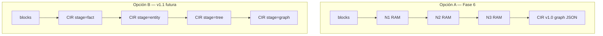

# CIR v1.0 — especificación congelada

> **Estado:** **Congelado:** Fase 6 · implementado  
> **Relación:** [Context Optimization Engine (COE).md](Context%20Optimization%20Engine%20(COE).md) § CIR · [level4.md](level4.md) · [level5.md](level5.md) · [renderer.md](renderer.md)  
> **Regla heredada:** CIR es **solo interno**; hacia el LLM sigue siendo prosa vía Renderer.

---

## 1. Tesis

**CIR v1.0 = el subgrafo semántico estable de `ContextGraph`**, más un sobre (envelope) mínimo de versión y trazabilidad.

No formaliza `DeduplicationResult` ni `FactorizationResult` como CIR paralelos. Esos tipos son **pasos de lowering** hacia el grafo; el contrato único aparece en **N4 materializado** y es lo que **N5 persiste** en `SemanticState.graph`.

```
ContextBlock[]  →  [N1–N3 lowering]  →  materialize  →  CIR v1.0 (graph)
                                                              ↓
                                                         N5 merge / store
                                                              ↓
                                                    Renderer → prosa (externo)
```

---

## 2. Qué tomamos de `ContextGraph` (IN)

### 2.1 Núcleo obligatorio

| Campo CIR | Origen actual | Rol |
|-----------|---------------|-----|
| `schema_version` | `ContextGraph.schema_version` | `"1.0"` (nuevo; hoy `"0.1"`) |
| `nodes[]` | `ContextGraph.nodes` | Vértices tipados |
| `edges[]` | `ContextGraph.edges` | Relaciones tipadas |
| `orphans[]` | `ContextGraph.orphans` | Cero pérdida — texto no graficable |

### 2.2 Nodo (`CIRNode` ≡ `GraphNode`)

```json
{
  "id": "juan",
  "kind": "person",
  "labels": ["Juan"],
  "properties": {},
  "source_refs": ["A", "B"]
}
```

Ejemplo `document` / `chunk` (RAG):

```json
{
  "id": "doc_budget_report",
  "kind": "document",
  "labels": ["Budget Report Q1"],
  "properties": { "uri": "rag://budget-q1" },
  "source_refs": ["A"]
}
```

```json
{
  "id": "chunk_budget_line",
  "kind": "chunk",
  "labels": ["Presupuesto: 50k"],
  "properties": { "parent_doc": "doc_budget_report" },
  "source_refs": ["A"]
}
```

| Campo | Obligatorio | v1.0 |
|-------|-------------|------|
| `id` | sí | Identidad canónica (casefold + strip en merge N5) |
| `kind` | sí | Enum cerrado v1.0: `person`, `organization`, `concept`, `document`, `chunk` |
| `labels` | sí (≥1 si hay nombre legible) | Post-L0; proyección prosa |
| `properties` | no | Ver §2.4 |
| `source_refs` | sí (puede `[]`) | Trazabilidad a `ContextBlock.id` |

**Decisión:** `document` y `chunk` **entran en v1.0** (antes solo en spec N4, no en builder). Materialización prevista: bloques `source_type=rag` → `document`; líneas o spans citables → `chunk`; arista `contains` document→chunk.

### 2.3 Arista (`CIREdge` ≡ `GraphEdge`)

```json
{
  "from": "juan",
  "to": "org_acme",
  "type": "company",
  "properties": {}
}
```

```json
{
  "from": "juan",
  "to": "concept_approved_budget",
  "type": "action",
  "properties": { "value": "approved the budget" }
}
```

| Campo | Obligatorio | v1.0 |
|-------|-------------|------|
| `from`, `to` | sí | IDs de nodos existentes |
| `type` | sí | Enum cerrado v1.0: `company`, `knows`, `action`, `contains`, `reference` |
| `properties` | no | `value` en `action`; `uri` opcional en `reference` |

**Decisión:** `action` es **arista**, no `person.properties.actions[]`. El builder N4 y el merge N5 dejan de usar la lista embebida; las acciones se modelan como `person --action--> concept` (o `--action--> chunk`) con `properties.value`.

| `type` | Semántica v1.0 |
|--------|----------------|
| `company` | person → organization |
| `knows` | person → person |
| `action` | entidad → concept/chunk; payload en `properties.value` |
| `contains` | document → chunk |
| `reference` | chunk → concept/person/org (cita) |

### 2.4 Orphan (`CIROrphan` ≡ `GraphOrphan`)

```json
{
  "text": "Línea no graficable.",
  "source_refs": ["C"]
}
```

Invariante N4: **grafo ∪ orphans ⊇ entrada N3**. CIR v1.0 conserva este invariante.

### 2.5 Vocabulario de `properties` (nodos)

| Clave | Origen | Uso |
|-------|--------|-----|
| `canonical_line` | N4 `concept` desde `global_facts` | Hecho global |
| `name` | N4 `organization` | Nombre de org |
| `uri` | N4 `document` | Origen RAG |
| `parent_doc` | N4 `chunk` | Enlace lógico al documento padre |
| `conflict` | N5 merge | `true` si hay contradicción |
| `conflict_entries` | N5 merge | Lista de entradas estructuradas (§2.6) |

Claves reservadas (no datos de dominio): `conflict`, `conflict_entries`, `retracts`, `superseded_by`.

**Deprecado en v1.0:** `properties.actions[]` en nodos — sustituido por aristas `action`.

### 2.6 Entrada de conflicto (N5)

```json
{
  "property": "amount",
  "previous": "50k",
  "incoming": "80k",
  "previous_sources": ["A"],
  "incoming_sources": ["B"]
}
```

Proyección a prosa: Renderer / `StateView.render()` — no forma parte del «átomo» mínimo, pero **sí** del vocabulario CIR v1.0 en nodos.

---

## 3. Qué dejamos fuera del átomo CIR (envelope / derivados)

Estos campos existen en `ContextGraph` pero **no son el CIR canónico** — son vista, métricas o parámetros de ejecución:

| Campo actual | Tratamiento CIR v1.0 |
|--------------|----------------------|
| `original_tokens`, `optimized_tokens`, `internal_tokens` | **Envelope.metrics** (opcional, no para merge) |
| `active_nodes`, `active_edges` | **Envelope.view** — subgrafo activo post-slice |
| `query_context`, `max_hops`, `include_orphans` | **Envelope.slice** — parámetros de la última proyección |
| `render_prose()`, `serialize_internal()` | **Operaciones**, no almacenadas en CIR |
| `complexity` | Derivado: `|nodes|`, `|edges|`, `|orphans|` |

### Envelope propuesto (serialización N5 / logs)

```json
{
  "cir_version": "1.0",
  "graph": {
    "nodes": [],
    "edges": [],
    "orphans": []
  },
  "view": {
    "active_node_ids": ["juan", "org_acme"],
    "active_edge_ids": null
  },
  "slice": {
    "query_context": null,
    "max_hops": 2,
    "include_orphans": true
  },
  "metrics": {
    "original_tokens": 0,
    "internal_tokens": 0
  }
}
```

**Persistencia N5 v1.1 (Fase 6):** `SemanticState.graph` guardaría `envelope.graph` como CIR; `view`/`slice` opcionales por commit.

---

## 4. Qué NO es CIR v1.0

| Artefacto | Rol en pipeline | CIR v1.0 |
|-----------|-----------------|----------|
| `ContextBlock` | Ingest / entrada | Pre-CIR (fuente) |
| `SharedFact` | N1 | Se baja a `concept` o queda en lowering |
| `DeduplicationResult` | N1 salida | Paso intermedio; no serializar como CIR |
| `EntityRecord` / `FactorizationResult` | N2 | Paso intermedio |
| `StructuredContext` | N3 | **Borrador** (`to_cir_draft()`); N4 lo materializa a grafo |
| `RetractRecord` | N5 store | Metadato de sesión, no del grafo |
| `StateView.prose` | Salida LLM | **Proyección**, nunca CIR |

---

## 5. Relación N3 borrador ↔ CIR v1.0

`StructuredContext.to_cir_draft()` hoy produce:

```json
{
  "schema_version": "0.1",
  "entities": [{ "id", "name", "relations": [] }],
  "global_facts": ["Empresa=ACME"],
  "unparsed": []
}
```

**Mapeo formal v1.0 (N4 `build_context_graph`):**

| Borrador N3 | CIR v1.0 |
|-------------|----------|
| `entities[]` + `relations[type=company]` | nodo `person` + arista `company` → nodo `organization` |
| `relations[type=knows]` | arista `knows` |
| `relations[type=action]` | arista `action` → nodo `concept` o `chunk`; `properties.value` |
| `source_type=rag` (Ingest) | nodo `document` + nodos `chunk`; arista `contains` |
| `global_facts[]` | nodo `kind=concept` + `properties.canonical_line` |
| `unparsed[]` | `orphans[]` |

CIR v1.0 **reemplaza** el borrador arbóreo de N3 por grafo normalizado; la función `structured_to_cir_draft` evolucionaría a `structured_to_cir_v1()` que emite el mismo JSON que `ContextGraph.to_dict()` sin campos derivados.

---

## 6. Transformaciones como pasos CIR

Fase 6 refactorizaría el pipeline así:

| Paso | Entrada CIR | Salida CIR | Estado hoy |
|------|-------------|------------|------------|
| **lower_n1** | — (blocks) | partial facts en memoria | `DeduplicationResult` |
| **lower_n2** | — | entidades en memoria | `FactorizationResult` |
| **lower_n3** | — | árbol relacional | `StructuredContext` |
| **materialize** | árbol | **CIR v1.0 graph** | `build_context_graph` |
| **slice** | CIR | CIR + `view` | `apply_query_slice` |
| **merge** | CIR + CIR | CIR (N5 head) | `merge_context_graphs` |
| **project** | CIR | prosa (externo) | `render_prose` / `StateView` |

N1–N3 permanecen implementaciones internas en Python. **Fase 6 adopta Opción A:** el único CIR versionado y persistido es el grafo N4+ (`stage=graph`). La promoción por `stage` (Opción B) queda diferida a CIR v1.1 si hiciera falta replay/cache por nivel.

**v1.0 congela solo `stage=graph`.**

---

## 7. Invariantes CIR v1.0

1. **Cero pérdida:** todo hecho de la entrada del turno está en `nodes`, `edges` o `orphans`.
2. **Ids estables:** mismo `id` → mismo nodo en merge N5.
3. **Proyectable:** ∃ `project(cir, locale) → str` validado por harness.
4. **No salida LLM:** `serialize_internal()` y JSON CIR no se envían al modelo en producción.
5. **Conflictos explícitos:** merge no elige ganador; marca `conflict` + entradas.
6. **Versión:** `cir_version` major bump solo con migración documentada.

---

## 8. Diff mínimo vs código actual

| Aspecto | Hoy (`GRAPH_SCHEMA_VERSION=0.1`) | CIR v1.0 |
|---------|----------------------------------|----------|
| Forma | `ContextGraph` dataclass | Igual + envelope nombrado |
| `kind` | libre string | enum cerrado 5 valores (`person`, `organization`, `concept`, `document`, `chunk`) |
| `edge.type` | libre string | enum cerrado 5 valores (`company`, `knows`, `action`, `contains`, `reference`) |
| `actions` en nodos | lista en `properties` | aristas `action` |
| Conflictos | en `properties` ad hoc | vocabulario documentado §2.5 |
| N5 serialize | `graph.to_dict()` completo | `envelope` sin métricas obligatorias |
| Tests | acoplados a dataclasses | + roundtrip JSON schema |

**Migración:** `ContextGraph.from_dict` acepta `cir_version: "1.0"` y `graph: { nodes, edges, orphans }`; alias del dict plano actual durante una release.

---

## 9. JSON Schema (esqueleto)

```json
{
  "$id": "https://coe.local/schema/cir-1.0.json",
  "type": "object",
  "required": ["cir_version", "graph"],
  "properties": {
    "cir_version": { "const": "1.0" },
    "graph": {
      "type": "object",
      "required": ["nodes", "edges", "orphans"],
      "properties": {
        "nodes": {
          "type": "array",
          "items": {
            "required": ["id", "kind", "labels", "source_refs"],
            "properties": {
              "id": { "type": "string" },
              "kind": { "enum": ["person", "organization", "concept", "document", "chunk"] },
              "labels": { "type": "array", "items": { "type": "string" } },
              "properties": { "type": "object" },
              "source_refs": { "type": "array", "items": { "type": "string" } }
            }
          }
        },
        "edges": {
          "type": "array",
          "items": {
            "required": ["from", "to", "type"],
            "properties": {
              "from": { "type": "string" },
              "to": { "type": "string" },
              "type": { "enum": ["company", "knows", "action", "contains", "reference"] },
              "properties": { "type": "object" }
            }
          }
        },
        "orphans": {
          "type": "array",
          "items": {
            "required": ["text", "source_refs"],
            "properties": {
              "text": { "type": "string" },
              "source_refs": { "type": "array", "items": { "type": "string" } }
            }
          }
        }
      }
    }
  }
}
```

Ubicación prevista Fase 6: `data/benchmarks/schema/cir-1.0.schema.json`.

---

## 10. Alcance Fase 6 sugerido (a partir de este borrador)

| Entregable | Basado en |
|------------|-----------|
| Spec `cir-v1.md` (congelar este borrador) | §1–9 |
| `cir-1.0.schema.json` | §9 |
| `CIRDocument` / alias `ContextGraph` | §2–3 |
| `lower_n3 → materialize` único writer de CIR | §5–6 |
| N5 `semantic_state_to_dict` usa envelope | §3 |
| Tests roundtrip + merge conflictos en CIR JSON | §7 |
| **Sin cambio** en política Renderer | §1 |

---

## 11. Decisiones cerradas

| # | Pregunta | Decisión |
|---|----------|----------|
| 1 | ¿`document` / `chunk` en v1.0? | **Sí** — §2.2 |
| 2 | ¿`action` como arista o en `properties`? | **Arista** — §2.3 |
| 3 | ¿N1/N2 como tipos internos o CIR por etapas? | **Opción A** — solo `stage=graph` serializado; N1–N3 permanecen en Python (§12) |
| 4 | ¿`active_edges` por ID explícito? | Pendiente — derivar de `active_node_ids` en v1.0 |

---

## 12. Explicación: N1/N2 internos vs CIR por etapas (`stage`)

Esta pregunta no afecta al **grafo final** (CIR v1.0 ya decidido). Afecta a **cuánto del pipeline serializas como CIR** antes de N4.

### Situación hoy

El pipeline usa **cuatro tipos distintos** en memoria:

```
ContextBlock[] → DeduplicationResult → FactorizationResult → StructuredContext → ContextGraph
     (ingest)          (N1)                  (N2)                 (N3)              (N4/N5)
```

Solo el último (`ContextGraph`) se persiste en N5 y se considera «el CIR». N1–N3 son pasos de cálculo en Python; no hay JSON estándar entre ellos salvo el borrador `to_cir_draft()` de N3.

### Opción A — N1/N2 internos «para siempre» (recomendada en Fase 6)

| Idea | Solo el **grafo N4+** es CIR versionado. N1–N3 siguen siendo funciones que transforman datos en RAM. |
| Ventaja | Menor refactor: Fase 6 formaliza envelope + schema del grafo; el pipeline casi no cambia. |
| Inconveniente | No puedes guardar/reanudar a mitad de pipeline (p. ej. cachear solo N2). Herramientas externas no ven estados intermedios. |
| Analogía compilador | Lexer/parser internos no son LLVM IR; solo el IR optimizable se serializa. |

**Encaja con tu CIR v1.0:** el contrato único es `stage=graph`. N1–N3 son «frontend» del compilador.

### Opción B — CIR v1.1 con `stage` (`fact` | `entity` | `tree` | `graph`)

| Idea | Un solo tipo `CIRDocument` con campo `stage` que evoluciona: |
|-------|--------------------------------------------------------------|
| `stage=fact` | Equivalente a N1: hechos compartidos + bloques únicos |
| `stage=entity` | Equivalente a N2: entidades con atributos |
| `stage=tree` | Equivalente a N3: `StructuredContext` |
| `stage=graph` | Equivalente a N4: nodos/aristas/orphans (v1.0) |

Cada nivel sería `CIRDocument_v1` con la misma `cir_version` pero distinto payload según `stage`. N1→N2→N3→N4 serían **promociones de stage**, no tipos Python sueltos.

| Ventaja | Un solo contrato serializable; logs, tests y herramientas ven el mismo formato en todo el pipeline; replay/debug por etapa. |
| Inconveniente | Más trabajo: definir schemas para 4 stages, migrar tests, validar promociones `fact→entity→tree→graph`. |

### Decisión Fase 6: Opción A (cerrada)

| Fase 6 | Formalizar **solo el grafo** (envelope + schema + N5 serialize). N1–N3 **no** se serializan como CIR. |
| Futuro (v1.1) | Opción B (`stage=fact|entity|tree|graph`) solo si se requiere cache intermedio, replay por nivel o inspección MCP de etapas. |

En resumen: **no tienes que implementar CIR por etapas en Fase 6**. v1.0 = grafo; N1–N3 son el «frontend» del compilador en RAM.


