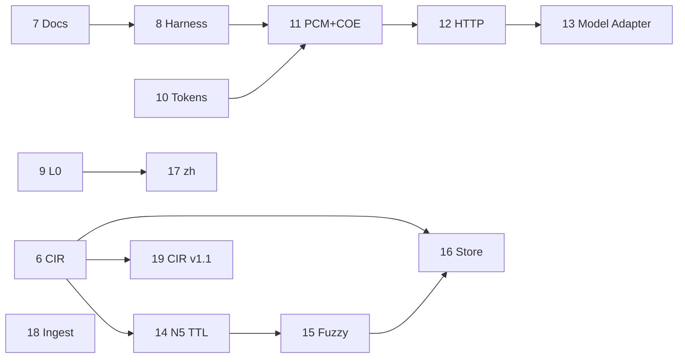

# Plan de ejecución COE — fuente única de verdad

> **Vigente desde:** 2026-07-05 · **Ampliado:** 2026-07-05  
> **Regla:** no se implementa nada fuera de la fase activa sin enmienda explícita de este documento.  
> **Gate por fase:** `python run.py --ci` PASS + actualizar tabla de progreso abajo.

---

## Por qué este documento existe

`architecture.md` §9 quedó obsoleto: marca N3–N5 como «investigación» y Gateway/MCP como futuro, pero el código ya tiene L0, N1–N5, harness H1–H5 y `FilesystemStateStore`. El trabajo reciente (casos `dev_agent`, baseline DevSSD, store en disco) fue útil pero **fuera de orden** respecto a las dependencias del diseño (Ingest → Renderer → Gateway → integración).

Este plan **reemplaza** `architecture.md` §9 como orden de trabajo. La arquitectura de piezas sigue en `architecture.md` §§1–8; el **orden de implementación** vive aquí.

---

## Principios de priorización (sin fechas)

Orden de las fases 6–18 según **dependencias técnicas** y **cierre de deuda**, no calendario:

1. **Contrato interno antes de escala** — CIR serializado antes de store distribuido e intercambio de grafos.
2. **Validación antes de integración externa** — harness con schema y más casos antes de HTTP/PCM en producción.
3. **Entrada antes de salida** — L0 e ingest maduros antes de locale `zh` y presupuesto de ventana.
4. **Superficies de integración en orden** — MCP ✅ → PCM+COE → HTTP → Model Adapter (cada capa asume la anterior estable).
5. **N5 escala tras CIR** — TTL, fuzzy linking y store remoto asumen envelope y merge probados.
6. **Investigación explícita** — hipótesis no validadas (ML, CIR hacia LLM) fuera del producto v1; pista I al final.

**Deuda que este plan elimina:** L0 parcial, README desactualizado, `case.schema.json` ausente, presupuesto tokens, PCM+COE, HTTP, Model Adapter, N5 post-v1 (TTL, fuzzy, store), locale `zh`, ingest `structured`/`code`, CIR v1.1 opcional.

**Fuera de alcance producto v1:** optimización por ML, representación no-prosa hacia el LLM, parser semántico dedicado, «capa universal» como estándar de industria.

---

## Estado real (foto 2026-07-05)

| Pieza | Spec | Código | Fase cierre |
|-------|------|--------|-------------|
| N1–N4 | ✅ | ✅ | 0–5 |
| N5 merge + commits | ✅ | ✅ | 3 |
| State Store filesystem | ✅ | ✅ | 3 |
| Gateway `optimize_context` | ✅ | ✅ | 1–3 |
| Context Ingest + matriz | ✅ | ✅ | 1 |
| Renderer unificado | ✅ | ✅ | 2 |
| Harness smoke + release script | ✅ | ✅ | 4 |
| MCP stdio | ✅ | ✅ | 5 |
| L0 | ✅ | ⚠️ parcial | **9** |
| CIR formal | 📝 borrador | ❌ | **6** |
| `case.schema.json` | — | ❌ | **8** |
| Casos benchmark | — | 6 | **8** |
| Presupuesto tokens COE | ✅ parcial | ❌ | **10** |
| PCM+COE runtime | ✅ doc | ❌ | **11** |
| HTTP API | ✅ doc | ❌ | **12** |
| Model Adapter | ✅ acotado | ❌ | **13** |
| N5 TTL / archivado | ✅ doc | ❌ | **14** |
| Entity linking fuzzy | ✅ diferido | ❌ | **15** |
| Store distribuido | ✅ doc | ❌ | **16** |
| Locale `zh` | ✅ doc | ❌ | **17** |
| Ingest `structured`/`code` | ✅ matriz | ⚠️ passthrough | **18** |
| CIR v1.1 (stage N1–N3) | — | ❌ | **19** (opcional) |
| Docs/README al día | — | ⚠️ | **7** |

---

## Reglas de ejecución estricta

1. **Una fase activa.** La fase actual es la primera fila con estado `🔄` o `⏳` en la tabla de progreso.
2. **Sin saltos.** No empezar tareas de fases posteriores aunque parezcan pequeñas.
3. **Cierre de fase** = todos los entregables ✅ + CI PASS + fila actualizada a `✅` + commit con `CI: PASS antes de push`.
4. **Enmiendas.** Si hace falta desviarse, primero se edita este archivo (sección «Enmiendas») y el usuario aprueba.
5. **Specs > código.** Si código y spec discrepan, el trabajo de la fase alinea código a spec (no al revés), salvo enmienda documentada.
6. **Release Ollama** — obligatorio en cierre de fases **8, 11, 15** (cambios que afectan calidad E2E); opcional en el resto. Comando: `bash scripts/ci/release-dev-agent.sh`.

---

## Fases cerradas (0–5)

Resumen; detalle histórico en commits de cierre.

| Fase | Nombre | Commit cierre |
|------|--------|---------------|
| 0 | Sincronizar documentación | — |
| 1 | Context Ingest + ContextBundle | — |
| 2 | Renderer + ensamblaje Gateway | — |
| 3 | N5 producción | d733bb7 |
| 4 | Harness madurez + casos reales | b8de213 |
| 5 | MCP COE | bf9ddf2 |

---

## Fases pendientes (6–18)

### Fase 6 — CIR formal ⏳

**Objetivo:** Contrato interno del grafo (Opción A). Base para store distribuido y persistencia intercambiable.

**Decisión:** formalizar **solo `stage=graph`**; N1–N3 siguen como tipos Python en memoria. Ver [cir-v1-draft.md](cir-v1-draft.md).

| Entregable | Criterio de hecho |
|------------|-------------------|
| Spec CIR v1.0 | `docs/cir-v1.md` congelado desde borrador |
| JSON Schema | `data/benchmarks/schema/cir-1.0.schema.json` |
| Builder N4 | `document`/`chunk`, aristas `action`/`contains`/`reference` |
| Envelope N5 | `semantic_state_to_dict` con `cir_version` + `graph` |
| Tests | Roundtrip JSON, merge conflictos, proyección prosa sin regresión smoke |
| **Fuera de alcance** | CIR `stage=fact\|entity\|tree`; refactor `DeduplicationResult` / `FactorizationResult` |

**Bloquea:** 16 (store distribuido), 19 (CIR v1.1).

---

### Fase 7 — Sincronización documental

**Objetivo:** Una sola narrativa veraz en índices y tablas; cero «parcial» falso donde el código ya cumple.

| Entregable | Criterio de hecho |
|------------|-------------------|
| `README.md` | Tabla estado alineada con este plan (Ingest/Renderer/Gateway ✅) |
| `architecture.md` §9 | Bloques A–F y tabla fases 0–18 |
| `spec-gaps.md` §8 | Checklist fases 6–18 |
| `vision.md` | Enlaces y estado producto v1 |
| CI | PASS (solo docs; sin regresión) |

**No incluye código de producto** salvo correcciones de docstrings que contradigan specs.

---

### Fase 8 — Harness contrato + corpus

**Objetivo:** Validación escalable antes de integraciones externas.

| Entregable | Criterio de hecho |
|------------|-------------------|
| `case.schema.json` | `data/benchmarks/schema/case.schema.json` + validación en loader |
| Casos nuevos | ≥4 casos adicionales: 2 `regression/`, 1 `multi_turn` ampliado, 1 `es/` |
| Corpus workflow | `docs/benchmark-harness.md`: cómo extraer de `corpus/transcripts/` |
| `run.py` | Target `--release-dev-agent` documentado (sigue fuera de `--ci`) |
| Gate release | Ejecutar `release-dev-agent.sh` PASS en cierre de fase |
| CI smoke | PASS; perfiles existentes sin regresión |

**Bloquea:** 11 (confianza E2E para PCM+COE).

---

### Fase 9 — L0 v2

**Objetivo:** Cumplir [l0-ingest.md](l0-ingest.md) más allá de heurística ES→EN.

| Entregable | Criterio de hecho |
|------------|-------------------|
| Detección idioma | Por bloque con confianza; `mixed_bundle` en `ingest_trace` |
| Política mezcla | Idioma dominante + override según [i18n.md](i18n.md) |
| Motor traducción | Interfaz `TranslationBackend` + implementación por defecto (p. ej. `deep-translator` o stub inyectable) |
| Exclusiones | Identificadores, fences, `preserve_lang` según spec |
| `translate_code_blocks` | Opt-in probado |
| Tests | ES→EN, EN skip, preserve_lang, mixed bundle |
| CI | PASS |

**Bloquea:** 17 (locale zh asume L0 robusto).

---

### Fase 10 — Presupuesto tokens COE

**Objetivo:** Implementar [ingest.md](ingest.md) § presupuesto para salida COE sola.

| Entregable | Criterio de hecho |
|------------|-------------------|
| `max_context_tokens` | Opción Gateway; truncado por prioridad documentada |
| Métricas | `metrics.truncated`, tokens antes/después truncado |
| N4/N5 slice | Recorte cooperativo antes de superar tope |
| Tests | Caso que fuerza truncado; smoke sin regresión |
| CI | PASS |

**Bloquea:** 11 (ventana conjunta COE+PCM).

---

### Fase 11 — Integración PCM+COE

**Objetivo:** Pipeline compuesto documentado en visión: instrucción comprimida + contexto optimizado.

| Entregable | Criterio de hecho |
|------------|-------------------|
| Modo composición | Gateway o wrapper `optimize_with_pcm()` con PCM como dependencia opcional |
| Presupuesto ventana | `max_window_tokens`: reparto instrucción (PCM) + contexto (COE) + reserva respuesta |
| Harness `coe+pcm` | Perfil mock mínimo + caso JSON; sin Ollama obligatorio en CI |
| Docs | `architecture.md` §3 + ejemplo integración |
| Release gate | `release-dev-agent.sh` PASS si cambia salida E2E |
| CI | PASS |

**Bloquea:** 12 (HTTP expone mismo contrato).

---

### Fase 12 — HTTP API

**Objetivo:** Misma superficie que MCP para pipelines RAG y despliegue.

| Entregable | Criterio de hecho |
|------------|-------------------|
| Servidor HTTP | `scripts/http/run_server.py` (FastAPI o stdlib+ASGI acorde a deps) |
| Endpoints | `POST /optimize`, `POST /estimate` — paridad con MCP |
| Tests | Integración HTTP smoke (TestClient) |
| Docs | `architecture.md` §7.2 + ejemplo curl |
| CI | PASS |

---

### Fase 13 — Model Adapter

**Objetivo:** Post-renderer según [architecture.md](architecture.md) §3.4.

| Entregable | Criterio de hecho |
|------------|-------------------|
| Interfaz | `ModelAdapter.adapt(text, target_model) -> str` |
| Registro | Adaptadores mínimos: `default`, `mistral`, `openai` (formato secciones/markers) |
| Gateway | `target_model` cableado; trace en metrics |
| Tests | Al menos 2 modelos con salida distinta verificable |
| CI | PASS |

---

### Fase 14 — N5 operaciones (TTL y archivado)

**Objetivo:** Store listo para sesiones largas sin crecimiento ilimitado.

| Entregable | Criterio de hecho |
|------------|-------------------|
| TTL sesión | `session_ttl_hours` + limpieza en load/sweep |
| Archivado | Export commit head a JSON CIR; opción `archive_session()` |
| Métricas store | Tamaño disco, commits podados, sesiones activas |
| Tests | TTL expirado, archivado roundtrip |
| CI | PASS |

---

### Fase 15 — Entity linking fuzzy v2

**Objetivo:** Cerrar deuda [spec-gaps.md](spec-gaps.md) §7 post-v1 N5.

| Entregable | Criterio de hecho |
|------------|-------------------|
| Matching | Normalización + alias + fuzzy conservador (ratio umbral configurable) |
| Merge | Mismo label canónico en turnos distintos → un nodo si supera umbral |
| Conflictos | Fuzzy no fusiona si `conflict: true` en ninguna versión |
| Tests | Casos positivo/negativo; benchmark multi_turn sin regresión factual |
| Release gate | `release-dev-agent.sh` PASS |
| CI | PASS smoke |

---

### Fase 16 — Store distribuido

**Objetivo:** N5 más allá de filesystem local.

| Entregable | Criterio de hecho |
|------------|-------------------|
| `StateStore` | Implementación `SQLiteStateStore` (o equivalente embebido) |
| Interfaz | Misma API que `FilesystemStateStore`; selección por config Gateway |
| Concurrencia | Documentar límites v1 (single-writer o lock file) |
| Tests | Persistencia entre procesos + CIR envelope de Fase 6 |
| CI | PASS |

**Requiere:** Fase 6 ✅.

---

### Fase 17 — Locale `zh`

**Objetivo:** Segundo locale pack completo según [i18n.md](i18n.md).

| Entregable | Criterio de hecho |
|------------|-------------------|
| Pack `zh` | `src/coe/locales/zh/` — patrones N2, plantillas renderer |
| Normalizer | Segmentación oraciones `zh` en ingest |
| L0 | `target_lang: zh` con traducción hacia zh |
| Caso benchmark | ≥1 caso `zh/` en harness |
| CI | PASS smoke |

**Requiere:** Fase 9 ✅.

---

### Fase 18 — Ingest `structured` y `code`

**Objetivo:** Reducir passthrough en matriz [ingest.md](ingest.md).

| Entregable | Criterio de hecho |
|------------|-------------------|
| `structured` | Parser JSON/logs/CSV → bloques N1-friendly |
| `code` | Política L0 off + dedup por línea/firma sin traducir |
| `glossary` | `preserve_lang` + N5 merge de términos |
| Tests | Un caso por `source_type` problemático |
| CI | PASS |

---

### Fase 19 — CIR v1.1 Opción B (opcional)

**Objetivo:** Serializar etapas N1–N3 como `stage=fact|entity|tree` si hace falta interoperabilidad o auditoría fina.

| Entregable | Criterio de hecho |
|------------|-------------------|
| Spec | `docs/cir-v1.1.md` |
| Schema | `cir-1.1.schema.json` retrocompatible con 1.0 |
| Builders | Lowering N1–N3 → CIR stages |
| Tests | Roundtrip + prosa sin regresión |

**Solo activar si Fase 6–18 ✅ y hay demanda concreta** (herramientas externas, compliance, debug avanzado). Si no, marcar `🚫 omitida` en progreso.

**Requiere:** Fase 6 ✅.

---

## Pista I — Investigación (sin fase obligatoria)

Temas de [Context Optimization Engine (COE).md](Context%20Optimization%20Engine%20(COE).md) § visión largo plazo **no** son deuda de producto v1:

| Tema | Por qué queda fuera del plan 6–18 |
|------|-----------------------------------|
| Representación intermedia hacia el LLM (no prosa) | Hipótesis no validada; producto eligió Renderer prosa |
| Optimización por ML / aprendizaje | Requiere corpus y métricas que el harness aún está madurando |
| Parser semántico dedicado upstream | Sustituye heurísticas N1–N3; proyecto aparte |
| Capa universal estándar de industria | Resultado de adopción, no de una fase de código |

**Criterio para promover a Fase 20+:** benchmark A/B que supere prosa en `comprehension_similarity` y `factual_recall` con latencia aceptable, documentado en `docs/research/`.

---

## Progreso

| Fase | Nombre | Estado | Commit cierre |
|------|--------|--------|---------------|
| 0 | Sincronizar documentación | ✅ cerrada | — |
| 1 | Context Ingest + ContextBundle | ✅ cerrada | — |
| 2 | Renderer + ensamblaje Gateway | ✅ cerrada | — |
| 3 | N5 producción | ✅ cerrada | d733bb7 |
| 4 | Harness madurez + casos reales | ✅ cerrada | b8de213 |
| 5 | MCP COE | ✅ cerrada | bf9ddf2 |
| 6 | CIR formal | ⏳ **activa** | — |
| 7 | Sincronización documental | ⏳ pendiente | — |
| 8 | Harness contrato + corpus | ⏳ pendiente | — |
| 9 | L0 v2 | ⏳ pendiente | — |
| 10 | Presupuesto tokens COE | ⏳ pendiente | — |
| 11 | Integración PCM+COE | ⏳ pendiente | — |
| 12 | HTTP API | ⏳ pendiente | — |
| 13 | Model Adapter | ⏳ pendiente | — |
| 14 | N5 operaciones (TTL) | ⏳ pendiente | — |
| 15 | Entity linking fuzzy | ⏳ pendiente | — |
| 16 | Store distribuido | ⏳ pendiente | — |
| 17 | Locale `zh` | ⏳ pendiente | — |
| 18 | Ingest structured/code | ⏳ pendiente | — |
| 19 | CIR v1.1 Opción B | ⏳ opcional | — |

**Leyenda:** ⏳ pendiente · 🔄 en curso · ✅ cerrada · 📝 diferido · 🚫 omitida

---

## Mapa de dependencias

---

## Enmiendas

| Fecha | Cambio | Motivo |
|-------|--------|--------|
| 2026-07-05 | Plan inicial | Desvío respecto a `architecture.md` §9; acuerdo de seguimiento estricto |
| 2026-07-05 | CIR v1.0 diseño | Opción A: solo grafo serializado; N1–N3 en Python; `document`/`chunk`; `action` arista |
| 2026-07-05 | Fases 6–18 + Pista I | Cierre de deuda sin presión de fechas; Fase 6 activa; 19 opcional |

---

## Documentos relacionados

| Documento | Rol |
|-----------|-----|
| [architecture.md](architecture.md) | Piezas y relaciones (qué construimos) |
| [execution-plan.md](execution-plan.md) | **Orden de trabajo (cuándo y en qué secuencia)** |
| [spec-gaps.md](spec-gaps.md) | Decisiones de diseño y deuda → fase |
| [cir-v1-draft.md](cir-v1-draft.md) | Borrador CIR v1.0 (Fase 6) |
| [l0-ingest.md](l0-ingest.md) | Spec Fase 9 |
| [ingest.md](ingest.md) | Spec Fases 1, 10, 18 |
| [benchmark-harness.md](benchmark-harness.md) | Spec Fase 8 |
| [level5.md](level5.md) | Spec Fases 14–16 |
