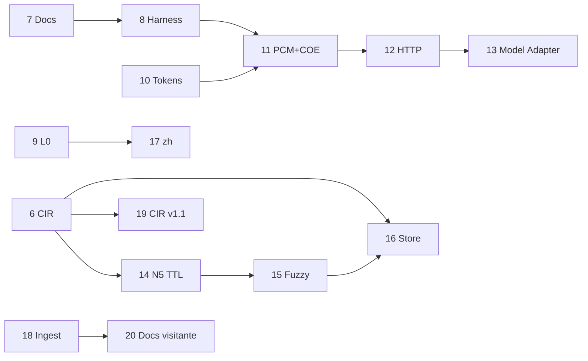

# Plan de ejecución COE — fuente única de verdad

> **Vigente desde:** 2026-07-05 · **Ampliado:** 2026-07-05  
> **Regla:** no se implementa nada fuera de la fase activa sin enmienda explícita de este documento.  
> **Gate por fase:** `python run.py --ci` PASS + actualizar tabla de progreso abajo.

---

## Por qué este documento existe

`architecture.md` §9 quedó obsoleto: marca N3–N5 como «investigación» y Gateway/MCP como futuro, pero el código ya tiene L0, N1–N5, harness H1–H5 y `FilesystemStateStore`. El trabajo reciente (casos `dev_agent`, baseline DevSSD, store en disco) fue útil pero **fuera de orden** respecto a las dependencias del diseño (Ingest → Renderer → Gateway → integración).

Este plan **reemplaza** `architecture.md` §9 como orden de trabajo. La arquitectura de piezas sigue en `architecture.md` §§1–8; el **orden de implementación** vive aquí.

---

## Principios de priorización (sin fechas)

Orden de las fases 6–18 según **dependencias técnicas** y **cierre de deuda**, no calendario:

1. **Contrato interno antes de escala** — CIR serializado antes de store distribuido e intercambio de grafos.
2. **Validación antes de integración externa** — harness con schema y más casos antes de HTTP/PCM en producción.
3. **Entrada antes de salida** — L0 e ingest maduros antes de locale `zh` y presupuesto de ventana.
4. **Superficies de integración en orden** — MCP ✅ → PCM+COE ✅ → HTTP ✅ → Model Adapter ✅ (Fases 5, 11–13).
5. **N5 escala tras CIR** — TTL, fuzzy linking y store remoto asumen envelope y merge probados.
6. **Investigación explícita** — hipótesis no validadas (ML, CIR hacia LLM) fuera del producto v1; pista I al final.
7. **Adopción tras v1** — documentación de visitante/integrador (Fase 20) antes de nuevas features o Pista I.

**Producto v1 cerrado (fases 0–18 ✅).** Documentación visitante (Fase 20) ✅. Fase 19 omitida.

**Deuda cerrada (fases 0–18):** núcleo L0→N5, CIR v1.0, harness, MCP, HTTP, PCM+COE, Model Adapter, N5 operaciones, fuzzy linking, SQLite store, locale `zh`, ingest structured/code/glossary.

**Fuera de alcance producto v1:** optimización por ML, representación no-prosa hacia el LLM, parser semántico dedicado, «capa universal» como estándar de industria, CIR v1.1 Opción B (ver Pista I / enmienda futura).

---

## Estado real (foto 2026-07-05 — producto v1)

| Pieza | Spec | Código | Fase cierre |
|-------|------|--------|-------------|
| N1–N4 | ✅ | ✅ | 0–5 |
| N5 merge + commits | ✅ | ✅ | 3 |
| State Store filesystem + SQLite | ✅ | ✅ | 3, **16** |
| Gateway `optimize_context` | ✅ | ✅ | 1–3 |
| Context Ingest + matriz | ✅ | ✅ | 1, **18** |
| Renderer unificado | ✅ | ✅ | 2 |
| Harness smoke + release script | ✅ | ✅ | 4, **8** |
| MCP stdio | ✅ | ✅ | 5 |
| HTTP API | ✅ | ✅ | **12** |
| L0 v2 | ✅ | ✅ | **9** |
| CIR formal (v1.0) | ✅ | ✅ | **6** |
| `case.schema.json` + casos | ✅ | ✅ | **8** |
| Presupuesto tokens COE | ✅ | ✅ | **10** |
| PCM+COE runtime | ✅ | ✅ | **11** |
| Model Adapter | ✅ | ✅ | **13** |
| N5 TTL / archivado | ✅ | ✅ | **14** |
| Entity linking fuzzy | ✅ | ✅ | **15** |
| Locale `zh` | ✅ | ✅ | **17** |
| Ingest structured/code/glossary | ✅ | ✅ | **18** |
| CIR v1.1 (stage N1–N3) | — | 🚫 omitida | **19** |
| Docs visitante / integrador | ✅ | ✅ | **20** |
| Docs/README al día (specs) | ✅ | ✅ | **7** |

---

## Reglas de ejecución estricta

1. **Plan producto v1 + docs visitante cerrados.** Nuevo trabajo → enmienda + fila en progreso o Pista I.
2. **Sin saltos** (durante el plan 0–18; histórico).
3. **Cierre de fase** = todos los entregables ✅ + CI PASS + fila actualizada a `✅` + commit con `CI: PASS antes de push`.
4. **Enmiendas.** Si hace falta desviarse, primero se edita este archivo (sección «Enmiendas») y el usuario aprueba.
5. **Specs > código.** Si código y spec discrepan, el trabajo de la fase alinea código a spec (no al revés), salvo enmienda documentada.
6. **Release Ollama (quality)** — obligatorio en cierre de fases **8, 11, 15** si hay cambios E2E. Comando: `python run.py --release-dev-agent` (qwen3:4b). Iteración rápida: `--benchmark-dev-agent-fast` — [benchmark-ollama.md](benchmark-ollama.md).

---

## Fases cerradas (0–13)

Resumen; detalle de entregables en secciones siguientes (fases 6–18).

| Fase | Nombre | Commit cierre |
|------|--------|---------------|
| 0 | Sincronizar documentación | — |
| 1 | Context Ingest + ContextBundle | — |
| 2 | Renderer + ensamblaje Gateway | — |
| 3 | N5 producción | d733bb7 |
| 4 | Harness madurez + casos reales | b8de213 |
| 5 | MCP COE | bf9ddf2 |
| 6 | CIR formal | dd51755 |
| 7 | Sincronización documental | 727a182 |
| 8 | Harness contrato + corpus | 872d5d1 |
| 9 | L0 v2 | d8fbbc4 |
| 10 | Presupuesto tokens COE | 81837d7 |
| 11 | Integración PCM+COE | 594f63b |
| 12 | HTTP API | b191a62 |
| 13 | Model Adapter | 8b84bb5 |
| 14 | N5 operaciones (TTL) | 76c3683 |
| 15 | Entity linking fuzzy | e8b45d5 |

---

## Detalle de fases (6–18)

### Fase 6 — CIR formal ✅

**Objetivo:** Contrato interno del grafo (Opción A). Base para store distribuido y persistencia intercambiable.

**Decisión:** formalizar **solo `stage=graph`**; N1–N3 siguen como tipos Python en memoria. Ver [cir-v1-draft.md](cir-v1-draft.md).

| Entregable | Criterio de hecho |
|------------|-------------------|
| Spec CIR v1.0 | `docs/cir-v1.md` congelado desde borrador |
| JSON Schema | `data/benchmarks/schema/cir-1.0.schema.json` |
| Builder N4 | `document`/`chunk`, aristas `action`/`contains`/`reference` |
| Envelope N5 | `semantic_state_to_dict` con `cir_version` + `graph` |
| Tests | Roundtrip JSON, merge conflictos, proyección prosa sin regresión smoke |
| **Fuera de alcance** | CIR `stage=fact\|entity\|tree`; refactor `DeduplicationResult` / `FactorizationResult` |

**Bloquea:** 16 (store distribuido), 19 (CIR v1.1).

---

### Fase 7 — Sincronización documental ✅

**Objetivo:** Una sola narrativa veraz en índices y tablas; cero «parcial» falso donde el código ya cumple.

| Entregable | Criterio de hecho |
|------------|-------------------|
| `README.md` | Tabla estado alineada con este plan (Ingest/Renderer/Gateway ✅) |
| `architecture.md` §9 | Bloques A–F y tabla fases 0–18 |
| `spec-gaps.md` §8 | Checklist fases 6–18 |
| `vision.md` | Enlaces y estado producto v1 |
| CI | PASS (solo docs; sin regresión) |

**No incluye código de producto** salvo correcciones de docstrings que contradigan specs.

---

### Fase 8 — Harness contrato + corpus ✅

**Objetivo:** Validación escalable antes de integraciones externas.

| Entregable | Criterio de hecho |
|------------|-------------------|
| `case.schema.json` | `data/benchmarks/schema/case.schema.json` + validación en loader |
| Casos nuevos | ≥4 casos adicionales: 2 `regression/`, 1 `multi_turn` ampliado, 1 `es/` |
| Corpus workflow | `docs/benchmark-harness.md`: cómo extraer de `corpus/transcripts/` |
| `run.py` | Target `--release-dev-agent` documentado (sigue fuera de `--ci`) |
| Gate release | Ejecutar `release-dev-agent.sh` PASS en cierre de fase |
| CI smoke | PASS; perfiles existentes sin regresión |

**Bloquea:** 11 (confianza E2E para PCM+COE).

---

### Fase 9 — L0 v2 ✅

**Objetivo:** Cumplir [l0-ingest.md](l0-ingest.md) más allá de heurística ES→EN.

| Entregable | Criterio de hecho |
|------------|-------------------|
| Detección idioma | Por bloque con confianza; `mixed_bundle` en `ingest_trace` |
| Política mezcla | Idioma dominante + override según [i18n.md](i18n.md) |
| Motor traducción | Interfaz `TranslationBackend` + implementación por defecto (p. ej. `deep-translator` o stub inyectable) |
| Exclusiones | Identificadores, fences, `preserve_lang` según spec |
| `translate_code_blocks` | Opt-in probado |
| Tests | ES→EN, EN skip, preserve_lang, mixed bundle |
| CI | PASS |

**Bloquea:** 17 (locale zh asume L0 robusto).

---

### Fase 10 — Presupuesto tokens COE ✅

**Objetivo:** Implementar [ingest.md](ingest.md) § presupuesto para salida COE sola.

| Entregable | Criterio de hecho |
|------------|-------------------|
| `max_context_tokens` | Opción Gateway; truncado por prioridad documentada |
| Métricas | `metrics.truncated`, tokens antes/después truncado |
| N4/N5 slice | Recorte cooperativo antes de superar tope |
| Tests | Caso que fuerza truncado; smoke sin regresión |
| CI | PASS |

**Bloquea:** 11 (ventana conjunta COE+PCM).

---

### Fase 11 — Integración PCM+COE ✅

**Objetivo:** Pipeline compuesto documentado en visión: instrucción comprimida + contexto optimizado.

| Entregable | Criterio de hecho |
|------------|-------------------|
| Modo composición | Gateway o wrapper `optimize_with_pcm()` con PCM como dependencia opcional |
| Presupuesto ventana | `max_window_tokens`: reparto instrucción (PCM) + contexto (COE) + reserva respuesta |
| Harness `coe+pcm` | Perfil mock mínimo + caso JSON; sin Ollama obligatorio en CI |
| Docs | `architecture.md` §3 + ejemplo integración |
| Release gate | `release-dev-agent.sh` PASS si cambia salida E2E |
| CI | PASS |

**Bloquea:** 12 (HTTP expone mismo contrato).

---

### Fase 12 — HTTP API ✅

**Objetivo:** Misma superficie que MCP para pipelines RAG y despliegue.

| Entregable | Criterio de hecho |
|------------|-------------------|
| Servidor HTTP | `scripts/http/run_server.py` (FastAPI o stdlib+ASGI acorde a deps) |
| Endpoints | `POST /optimize`, `POST /estimate` — paridad con MCP |
| Tests | Integración HTTP smoke (TestClient) |
| Docs | `architecture.md` §7.3 + ejemplo curl |
| CI | PASS |

---

### Fase 13 — Model Adapter ✅

**Objetivo:** Post-renderer según [architecture.md](architecture.md) §3.4.

| Entregable | Criterio de hecho |
|------------|-------------------|
| Interfaz | `ModelAdapter.adapt(text, target_model) -> str` |
| Registro | Adaptadores mínimos: `default`, `mistral`, `openai` (formato secciones/markers) |
| Gateway | `target_model` cableado; trace en metrics |
| Tests | Al menos 2 modelos con salida distinta verificable |
| CI | PASS |

---

### Fase 14 — N5 operaciones (TTL y archivado) ✅

**Objetivo:** Store listo para sesiones largas sin crecimiento ilimitado.

| Entregable | Criterio de hecho |
|------------|-------------------|
| TTL sesión | `session_ttl_hours` + limpieza en load/sweep |
| Archivado | Export commit head a JSON CIR; opción `archive_session()` |
| Métricas store | Tamaño disco, commits podados, sesiones activas |
| Tests | TTL expirado, archivado roundtrip |
| CI | PASS |

---

### Fase 15 — Entity linking fuzzy v2 ✅

**Objetivo:** Cerrar deuda [spec-gaps.md](spec-gaps.md) §7 post-v1 N5.

| Entregable | Criterio de hecho |
|------------|-------------------|
| Matching | Normalización + alias + fuzzy conservador (ratio umbral configurable) |
| Merge | Mismo label canónico en turnos distintos → un nodo si supera umbral |
| Conflictos | Fuzzy no fusiona si `conflict: true` en ninguna versión |
| Tests | Casos positivo/negativo; benchmark multi_turn sin regresión factual |
| Release gate | `release-dev-agent.sh` PASS |
| CI | PASS smoke |

---

### Fase 16 — Store distribuido ✅

**Objetivo:** N5 más allá de filesystem local.

| Entregable | Criterio de hecho |
|------------|-------------------|
| `StateStore` | Implementación `SQLiteStateStore` (o equivalente embebido) |
| Interfaz | Misma API que `FilesystemStateStore`; selección por config Gateway |
| Concurrencia | Documentar límites v1 (single-writer o lock file) |
| Tests | Persistencia entre procesos + CIR envelope de Fase 6 |
| CI | PASS |

**Requiere:** Fase 6 ✅.

---

### Fase 17 — Locale `zh` ✅

**Objetivo:** Segundo locale pack completo según [i18n.md](i18n.md).

| Entregable | Criterio de hecho |
|------------|-------------------|
| Pack `zh` | `src/coe/locales/zh/` — patrones N2, plantillas renderer |
| Normalizer | Segmentación oraciones `zh` en ingest |
| L0 | `target_lang: zh` con traducción hacia zh |
| Caso benchmark | ≥1 caso `zh/` en harness |
| CI | PASS smoke |

**Requiere:** Fase 9 ✅.

---

### Fase 18 — Ingest `structured` y `code` ✅

**Objetivo:** Reducir passthrough en matriz [ingest.md](ingest.md).

| Entregable | Criterio de hecho |
|------------|-------------------|
| `structured` | Parser JSON/logs/CSV → bloques N1-friendly |
| `code` | Política L0 off + dedup por línea/firma sin traducir |
| `glossary` | `preserve_lang` + N5 merge de términos |
| Tests | Un caso por `source_type` problemático |
| CI | PASS |

---

### Fase 19 — CIR v1.1 Opción B 🚫 **omitida**

**Objetivo:** Serializar etapas N1–N3 como `stage=fact|entity|tree` si hace falta interoperabilidad o auditoría fina.

| Entregable | Criterio de hecho |
|------------|-------------------|
| Spec | `docs/cir-v1.1.md` |
| Schema | `cir-1.1.schema.json` retrocompatible con 1.0 |
| Builders | Lowering N1–N3 → CIR stages |
| Tests | Roundtrip + prosa sin regresión |

**Decisión 2026-07-05:** omitida tras cierre Fase 18. CIR v1.0 (`stage=graph`) cubre persistencia N5 e integración actual. Reactivar solo vía enmienda + demanda concreta (herramientas externas, compliance, debug por etapa).

**Requiere:** Fase 6 ✅.

---

### Fase 20 — Documentación visitante e integrador ✅

**Objetivo:** Reorganizar la documentación del repo para que un visitante de GitHub (sin conocer N1–N5) pueda **entender, probar e integrar** COE en minutos. Separar **producto/adopción** (README, guías) de **diseño/mantenimiento** (specs, execution-plan).

**Audiencias:**

| Audiencia | Necesita | No necesita (en portada) |
|-----------|----------|---------------------------|
| Visitante GitHub | Qué es, before/after, quickstart | Tabla spec vs implementación |
| Integrador (RAG, agente) | MCP, HTTP, `levels`, `session_id`, `source_type` | CIR, lowering, merge N5 |
| Maintainer | execution-plan, architecture, level1–5 | — |

| Entregable | Criterio de hecho |
|------------|-------------------|
| **README.md** reordenado | Arriba: propuesta + diagrama + 3 caminos (librería / MCP / HTTP) + ejemplo before/after con tokens; abajo: enlaces. Tabla de estado **fuera** del primer pantallazo |
| **`docs/getting-started.md`** | Guía por tareas: RAG one-shot, sesión N5 multi-turn, L0 ES→EN, structured/code/glossary, PCM+COE, Cursor MCP, `curl` HTTP |
| **`docs/STATUS.md`** (o equivalente) | Tabla spec/implementación + fases cerradas; enlace desde README en sección «Para mantenedores» |
| **`docs/FAQ.md`** | ≥8 preguntas: ¿resume?, ¿reemplaza RAG?, cuándo `levels`, cuándo `session_id`, MCP vs HTTP, relación PCM, limitaciones heurísticas |
| **Ejemplos** | `data/examples/`: al menos MCP JSON, HTTP body, sesión N5, bloque `structured`/`code`/`glossary` |
| **Consistencia docs** | Corregir desalineaciones conocidas: `architecture.md` §6 (modelo de datos), conteo tests en README, licencia |
| **`LICENSE`** | MIT formalizado (README ya lo declara) |
| **`CHANGELOG.md`** | Entrada v1.0.0 producto (fases 0–18) |
| **Enlaces cruzados** | `vision.md` → getting-started; architecture §7 → getting-started (no duplicar curl/MCP enteros) |

**Fuera de alcance Fase 20:** reescribir level1–5; Pista I; `pyproject.toml` / PyPI (opcional enmienda posterior); Docker (opcional enmienda posterior).

**Gate:** revisión manual «visitante limpio» (clonar → README → demo o MCP en <15 min) + `python run.py --ci` PASS — **234 tests, 10 smokes PASS** (2026-07-05). Commit: `dde77a1`.

**Requiere:** Fases 0–18 ✅.

---

### Fase 21 — Visitor adoption mitigation (EN) ✅

**Objetivo:** Cerrar fricciones de adopción post-revisión visitante (2026-07-05): ejemplo canónico coherente, `pip install -e .`, docs de usuario en inglés, DX helpers.

| Entregable | Criterio de hecho |
|------------|-------------------|
| **`acme_rag_en.json`** + demo | `run.py --demo` usa `optimize_context([1,2])` EN; README alineado |
| **`pyproject.toml`** | `pip install -e ".[dev]"` sin `PYTHONPATH` |
| **`--quickstart`** | Snippet Python copy-paste |
| **`print_cursor_config.py`** | JSON MCP con rutas absolutas |
| **Docs EN** | README, getting-started, FAQ, examples README |
| **`docs/es/`** | Archivo español pre-migración |
| **FAQ ampliado** | When not to use, savings, MCP optional deps |
| **CHANGELOG 1.0.2** | Entrada release |

**Fuera de alcance:** PyPI publish, Docker, GitHub Actions, cambios pipeline.

**Gate:** `python run.py --ci` PASS — **238 tests, 10 smokes PASS** (2026-07-05).

**Plan:** [plans/2026-07-05-visitor-adoption-mitigation.md](plans/2026-07-05-visitor-adoption-mitigation.md)

**Requiere:** Fase 20 ✅.

---

## Pista I — Investigación (sin fase obligatoria)

Temas de [Context Optimization Engine (COE).md](Context%20Optimization%20Engine%20(COE).md) § visión largo plazo **no** son deuda de producto v1:

| Tema | Por qué queda fuera del plan 6–18 |
|------|-----------------------------------|
| Representación intermedia hacia el LLM (no prosa) | Hipótesis no validada; producto eligió Renderer prosa |
| Optimización por ML / aprendizaje | Requiere corpus y métricas que el harness aún está madurando |
| Parser semántico dedicado upstream | Sustituye heurísticas N1–N3; proyecto aparte |
| Capa universal estándar de industria | Resultado de adopción, no de una fase de código |

**Criterio para promover a Fase 20+:** benchmark A/B que supere prosa en `comprehension_similarity` y `factual_recall` con latencia aceptable, documentado en `docs/research/`.

---

## Progreso

| Fase | Nombre | Estado | Commit cierre |
|------|--------|--------|---------------|
| 0 | Sincronizar documentación | ✅ cerrada | — |
| 1 | Context Ingest + ContextBundle | ✅ cerrada | — |
| 2 | Renderer + ensamblaje Gateway | ✅ cerrada | — |
| 3 | N5 producción | ✅ cerrada | d733bb7 |
| 4 | Harness madurez + casos reales | ✅ cerrada | b8de213 |
| 5 | MCP COE | ✅ cerrada | bf9ddf2 |
| 6 | CIR formal | ✅ cerrada | dd51755 |
| 7 | Sincronización documental | ✅ cerrada | 727a182 |
| 8 | Harness contrato + corpus | ✅ cerrada | 872d5d1 |
| 9 | L0 v2 | ✅ cerrada | d8fbbc4 |
| 10 | Presupuesto tokens COE | ✅ cerrada | 81837d7 |
| 11 | Integración PCM+COE | ✅ cerrada | 594f63b |
| 12 | HTTP API | ✅ cerrada | b191a62 |
| 13 | Model Adapter | ✅ cerrada | 8b84bb5 |
| 14 | N5 operaciones (TTL) | ✅ cerrada | 76c3683 |
| 15 | Entity linking fuzzy | ✅ cerrada | e8b45d5 |
| 16 | Store distribuido | ✅ cerrada | 8d23a72 |
| 17 | Locale `zh` | ✅ cerrada | 6ec6435 |
| 18 | Ingest structured/code | ✅ cerrada | 2c91a7e |
| 19 | CIR v1.1 Opción B | 🚫 omitida | — |
| 20 | Docs visitante e integrador | ✅ cerrada | — |

**Leyenda:** ⏳ pendiente · 🔄 en curso · ✅ cerrada · 📝 diferido · 🚫 omitida

---

## Mapa de dependencias

> **Fase 20** (docs visitante): post-v1; depende del cierre 0–18, no de código nuevo.

---

## Enmiendas

| Fecha | Cambio | Motivo |
|-------|--------|--------|
| 2026-07-05 | Plan inicial | Desvío respecto a `architecture.md` §9; acuerdo de seguimiento estricto |
| 2026-07-05 | CIR v1.0 diseño | Opción A: solo grafo serializado; N1–N3 en Python; `document`/`chunk`; `action` arista |
| 2026-07-05 | Fases 6–18 + Pista I | Cierre de deuda sin presión de fechas; Fase 6 activa; 19 opcional |
| 2026-07-05 | Fase 6 CIR v1.0 | Envelope, schema, action aristas, document/chunk RAG |
| 2026-07-05 | Fase 8 harness | case.schema.json, 4 casos, validación loader; release Ollama manual si Ollama local |
| 2026-07-05 | Cierre Fase 9 L0 v2 | d8fbbc4 — langdetect, TranslationBackend, mixed bundle |
| 2026-07-05 | Cierre Fase 10 presupuesto | 81837d7 — max_context_tokens, budget/, métricas truncated |
| 2026-07-05 | Cierre Fase 11 PCM+COE | 594f63b — optimize_with_pcm, perfil coe_pcm_n1_en |
| 2026-07-05 | Cierre Fase 12 HTTP | b191a62 — FastAPI /optimize, /estimate, /health |
| 2026-07-05 | Cierre Fase 13 Model Adapter | 8b84bb5 — target_model, adaptadores default/mistral/openai |
| 2026-07-05 | Cierre Fase 20 docs visitante | dde77a1 — README, getting-started, FAQ, STATUS, ejemplos, LICENSE, CHANGELOG 1.0.1 |
| 2026-07-05 | Fase 20 docs visitante | Reorganizar README, getting-started, STATUS, FAQ y ejemplos para adopción GitHub |
| 2026-07-05 | Producto v1 cerrado; Fase 19 omitida | Fases 0–18 ✅; CIR v1.1 sin demanda; Pista I para investigación |
| 2026-07-05 | Cierre Fase 18 ingest structured/code/glossary | 2c91a7e — flatten JSON/CSV/log, code dedup, N5 glossary |
| 2026-07-05 | Cierre Fase 17 locale zh | 6ec6435 — pack zh, segmentación, L0 EN→ZH stub, benchmark n1_n2_zh |
| 2026-07-05 | Cierre Fase 16 store SQLite | 8d23a72 — SQLiteStateStore, state_store_backend/path, WAL v1 |
| 2026-07-05 | Cierre Fase 15 entity linking fuzzy | e8b45d5 — fuzzy_link_threshold, alias map, merge N5 |

---

## Documentos relacionados

| Documento | Rol |
|-----------|-----|
| [architecture.md](architecture.md) | Piezas y relaciones (qué construimos) |
| [execution-plan.md](execution-plan.md) | **Orden de trabajo (cuándo y en qué secuencia)** |
| [spec-gaps.md](spec-gaps.md) | Decisiones de diseño y deuda → fase |
| [cir-v1.md](cir-v1.md) | Spec CIR v1.0 congelada (Fase 6) |
| [cir-v1-draft.md](cir-v1-draft.md) | Borrador histórico CIR v1.0 |
| [l0-ingest.md](l0-ingest.md) | Spec Fase 9 |
| [ingest.md](ingest.md) | Spec Fases 1, 10, 18 |
| [benchmark-harness.md](benchmark-harness.md) | Spec Fase 8 |
| [benchmark-ollama.md](benchmark-ollama.md) | Evaluadores Ollama fast vs quality |
| [level5.md](level5.md) | Spec Fases 14–16 |
| [getting-started.md](getting-started.md) | **Fase 20** — guía integrador (visitante) |
| [STATUS.md](STATUS.md) | **Fase 20** — tabla spec/implementación (maintainers) |
| [FAQ.md](FAQ.md) | **Fase 20** — preguntas frecuentes adopción |
