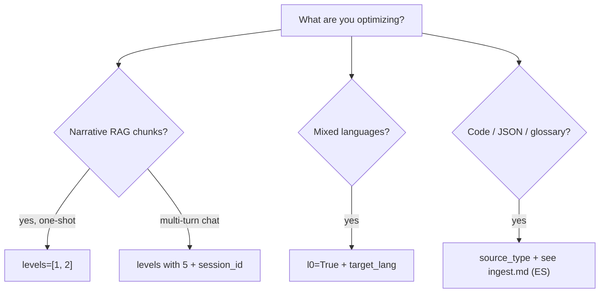

# Getting started — integrate COE without reading the pipeline

This guide is for **using** COE (RAG, agents, HTTP). You do not need to know pipeline internals.

- FAQ: [FAQ.md](FAQ.md)
- Maintainer status (ES): [STATUS.md](STATUS.md)
- Deep design (ES): [architecture.md](architecture.md)

## Installation

| I want… | Install |
|---------|---------|
| Try demo / Python library | `pip install -e ".[dev]"` |
| MCP server | `pip install -e ".[mcp]"` |
| HTTP API | `pip install -e ".[http]"` |
| Everything locally | `pip install -e ".[dev,mcp,http]"` |

```bash
git clone https://github.com/ntnglz/Context-Optimization-Engine.git
cd Context-Optimization-Engine
python3 -m venv .venv && source .venv/bin/activate
pip install -e ".[dev]"
```

**Without editable install:** `pip install -r requirements.txt` and `export PYTHONPATH=src` from the repo root.

## Try in 30 seconds

```bash
python run.py --demo
python run.py --quickstart   # adds copy-paste Python snippet
```

You will see deduplication + entity grouping on the canonical ACME example (blocks A, B, C).

## Decision guide



---

## Python library

### RAG one-shot (recommended: dedup + entity grouping)

```python
from coe import optimize_context
from coe.models import ContextBlock

blocks = [
    ContextBlock(id="A", content="Company: ACME\nJuan works at ACME.", source_type="rag"),
    ContextBlock(id="B", content="Company: ACME\nBudget: 50k\nJuan approved the budget.", source_type="rag"),
    ContextBlock(id="C", content="Company: ACME\nPedro works at ACME.", source_type="rag"),
]

out = optimize_context(blocks, levels=[1, 2], locale="en")
print(out.text)
print(out.metrics.compression_ratio, out.metrics.original_tokens, out.metrics.optimized_tokens)
```

JSON example: [../data/examples/acme_rag_en.json](../data/examples/acme_rag_en.json)

### Multi-turn session (session memory)

Turn 1 and turn 2 share `session_id`; COE accumulates state in a store (filesystem by default).

```python
from coe import optimize_context
from coe.models import ContextBlock

session = "my-agent-session"

# Turn 1
optimize_context(
    [ContextBlock(id="t1-A", content="Company: ACME\nJuan works at ACME.", source_type="rag")],
    levels=[1, 4, 5],
    locale="en",
    session_id=session,
)

# Turn 2 — previous state is merged
out = optimize_context(
    [ContextBlock(id="t2-A", content="Company: ACME\nJuan approved the budget.", source_type="rag")],
    levels=[1, 4, 5],
    locale="en",
    session_id=session,
)
print(out.text)
```

Optional SQLite store:

```python
optimize_context(
    blocks,
    levels=[1, 5],
    session_id=session,
    state_store_backend="sqlite",
    state_store_path="data/sessions/agent.db",
)
```

### L0 — context in another language (ES → EN)

```python
out = optimize_context(
    [
        ContextBlock(id="A", content="Empresa: ACME\nJuan trabaja en ACME."),
        ContextBlock(id="B", content="Empresa: ACME\nJuan aprobó el presupuesto."),
    ],
    levels=[1, 2],
    locale="en",
    target_lang="en",
    l0=True,
)
```

### `structured`, `code`, `glossary` blocks

Use `ingest_context` or pass blocks with `source_type`:

```python
from coe import ingest_context, optimize_context

ingested = ingest_context([
    {"id": "json-1", "source_type": "structured", "content": '{"company": "ACME", "budget": "50k"}'},
])
out = optimize_context(ingested.bundle, levels=[1])
```

Examples: [../data/examples/structured_block.json](../data/examples/structured_block.json), [code_blocks.json](../data/examples/code_blocks.json), [glossary_block.json](../data/examples/glossary_block.json).

---

## MCP (Cursor, Claude Desktop)

### Start server

```bash
pip install -e ".[mcp]"
python scripts/mcp/run_server.py
```

### Cursor configuration

Generate config with absolute paths:

```bash
python scripts/mcp/print_cursor_config.py
# paste into Settings → MCP, or:
python scripts/mcp/print_cursor_config.py > .cursor/mcp.json
```

### Tools

| Tool | Returns |
|------|---------|
| `optimize_context` | `text` (prose) + `metrics` |
| `estimate_savings` | `metrics` only (no prose) |

Example payload: [../data/examples/mcp_optimize_rag.json](../data/examples/mcp_optimize_rag.json)

---

## HTTP API

### Start server

```bash
pip install -e ".[http]"
python scripts/http/run_server.py
# http://127.0.0.1:8080
```

### Endpoints

| Method | Route | Description |
|--------|-------|-------------|
| GET | `/health` | Service status |
| POST | `/optimize` | Optimized context + metrics |
| POST | `/estimate` | Metrics only |

### curl example

```bash
curl -s http://127.0.0.1:8080/health

curl -s -X POST http://127.0.0.1:8080/optimize \
  -H 'Content-Type: application/json' \
  -d @data/examples/http_optimize_rag.json
```

Minimal body:

```json
{
  "blocks": [
    {"id": "A", "source_type": "rag", "content": "Company: ACME\nJuan works at ACME."},
    {"id": "B", "source_type": "rag", "content": "Company: ACME\nBudget: 50k\nJuan approved the budget."}
  ],
  "levels": [1, 2],
  "locale": "en"
}
```

Full API schema: [architecture.md §7.3](architecture.md) *(ES)*.

---

## PCM + COE

COE optimizes **context**; PCM optimizes **instructions**. Compose in one flow:

```python
from coe import optimize_with_pcm

result = optimize_with_pcm(
    context_blocks=[...],
    instruction="TASK=answer ...",
    levels=[1, 2],
    locale="en",
    max_window_tokens=8192,
)
# result.context_text, result.instruction_text, result.metrics
```

Requires PCM installed per the [PCM repository](https://github.com/ntnglz/Prompt-Compression-Middleware).

---

## Options that matter most

| Parameter | When to use |
|-----------|-------------|
| `levels` | `[1,2]` RAG; add `5` + `session_id` for chat |
| `locale` | `"en"`, `"es"`, `"zh"` — prose patterns |
| `l0` + `target_lang` | Unify context language before processing |
| `session_id` | Required when level 5 is enabled |
| `max_context_tokens` | Truncate output if over limit |
| `target_model` | Post-renderer tuning (mistral, openai, …) |
| `query_context` | Slice graph/session toward current question |
| `source_type` | `rag`, `code`, `structured`, `glossary`, … — see [ingest.md](ingest.md) *(ES)* |

### Metrics (`out.metrics`)

| Field | Meaning |
|-------|---------|
| `original_tokens` | Estimated input |
| `optimized_tokens` | Prose output |
| `compression_ratio` | Relative savings |
| `latency_ms` | Total time |
| `truncated` | Token cap was applied |

---

## Further reading

| If you want… | Read |
|--------------|------|
| Level & ingest details | [ingest.md](ingest.md), [levels.md](levels.md) *(ES)* |
| Multilingual | [i18n.md](i18n.md), [l0-ingest.md](l0-ingest.md) *(ES)* |
| Benchmarks / quality | [benchmarks.md](benchmarks.md) *(ES)* |
| Contribute / roadmap | [execution-plan.md](execution-plan.md) *(ES)* |
