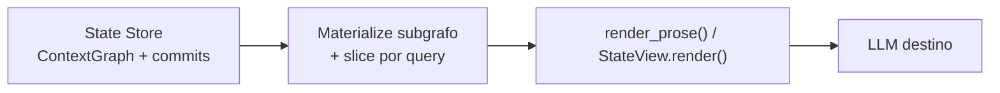

# Nivel 5 — Estado semántico

> Definición conceptual: [documento fundacional](Context%20Optimization%20Engine%20(COE).md#nivel-5--estado-semántico).  
> Nivel anterior: [level4.md](level4.md) · Índice: [levels.md](levels.md)

**Estado:** ✅ Spec aprobada · **v1 implementado** (`src/coe/level5/` · sin grafo N4)

## Alineación con la visión fundacional

| Principio ([COE].md) | Cómo lo cumple N5 |
|----------------------|-------------------|
| Optimizar contexto multi-turno | State Store + vista acotada |
| No resumir en store | Commits conservan historial; vista al LLM puede omitir con benchmark |
| LLM consume prosa | `StateView.render()` obligatorio |
| Composición N4 → N5 | Persiste `ContextGraph`; proyección vía N4 `render_prose()` |
| Benchmarks / operabilidad | Línea base pre-L0; redacción + latencia P95 ≤350 ms ([benchmarks.md](benchmarks.md)) |
| Renderer / Ingest | Vista sin duplicar turno ([renderer.md](renderer.md)); merge + alias ([ingest.md](ingest.md)) |

[COE]: Context%20Optimization%20Engine%20(COE).md

## Qué recibe el LLM destino (respuesta directa)

**Sí: solo texto en lenguaje natural**, generado a partir del estado almacenado — **nunca** el State Store, el grafo interno ni notación de diff cruda.

| Capa | Qué es | ¿Va al LLM? |
|------|--------|-------------|
| **State Store** | Grafo versionado + historial de commits | ❌ Nunca |
| **ContextGraph** (`head`) | Representación interna acumulada (CIR) | ❌ Nunca como salida principal |
| **`StateView.render()`** | Prosa en `target_lang` materializada desde subgrafo + cambios recientes | ✅ **Única** salida autorizada de contexto N5 |
| Metadatos de turno (opcional) | Bloque del turno actual ya pasado por L0→N4 | ✅ Prosa del turno + vista de estado |

Flujo hacia el modelo:



El LLM **no** interpreta el store: lee una **proyección textual** equivalente en hechos al subgrafo seleccionado (más el bundle del turno si aplica). La eficiencia del store (grafo, diff interno, deduplicación entre turnos) es irrelevante para el modelo si esa proyección no es clara.

## Proyección a prosa: pieza crítica de N5

N5 hereda la **representación dual** de N3/N4 y la hace **obligatoria entre almacenamiento y consumidor**:

| Cara | Formato | Consumidor | Rol |
|------|---------|------------|-----|
| **Interna (persistida)** | `ContextGraph` en `SemanticState`, diffs estructurados entre commits | State Store, merge, retención, auditoría | Organización y evolución temporal |
| **Externa (LLM)** | `StateView.render()` — prosa explícita, sin abreviaturas opacas | LLM destino | **Único** canal de comprensión |

Reglas no negociables:

1. **Todo hecho incluido en la vista al LLM** debe poder trazarse a nodos/aristas/`orphans` del `head` (o al diff reciente materializado a prosa).
2. **`render_prose()` del grafo acumulado** es el mecanismo previsto (reutilizar proyección N4 sobre subgrafo activo + sección de cambios en lenguaje natural).
3. **Formatos internos prohibidos en la vista:** `node:`, `edge:`, IDs opacos (`[E1]`), diffs tipo `+edge(juan→x)`, JSON de grafo — salvo experimento explícito **fallido** en benchmark.
4. **Omisión en vista ≠ olvido:** lo no enviado al LLM sigue en el store; la decisión de omitir exige validación de comprensión (ver abajo), no solo ahorro de tokens.

Si el grafo almacenado no **traduce bien a prosa**, N5 falla aunque el store sea compacto y coherente internamente.

## Objetivo

Mantener un **estado semántico persistente** entre turnos de conversación o sesiones de agente, de modo que al LLM se le envíe una **vista materializada** del estado actual (y opcionalmente un diff reciente), no el historial completo ni todo el contexto acumulado.

Analogía Git:

| Concepto Git | Equivalente N5 |
|--------------|----------------|
| Repositorio | **State Store** |
| Commit | Snapshot del grafo/estado tras un turno |
| Working tree | Estado pendiente de consolidar |
| Diff (interno) | Delta estructural entre commits (materializado a prosa si va al LLM) |
| Checkout | **`StateView.render()`** — prosa del subgrafo activo para el modelo |

## Naturaleza del procesado

| Aspecto | Nivel 5 |
|---------|---------|
| **Persistencia** | **Sí.** Primer nivel con **State Store** durable (o session-scoped configurable). |
| **Tipo de matching** | **Temporal / diff** — qué cambió respecto al estado previo |
| **Unidad** | Delta sobre `ContextGraph` + metadatos de turno |
| **Dependencia** | Diseñado para ejecutarse **después de N4** (o N3 si N4 desactivado, con grafo mínimo) |

N5 **sí puede omitir información** del historial en la **vista enviada al LLM**, pero el historial completo permanece en el State Store y es recuperable. Esto difiere de N1–N4, que no eliminan información del bundle procesado.

Distinción crítica:

| | N1–N4 | N5 |
|---|-------|-----|
| Pérdida en salida | No — reorganización total reversible del bundle |
| Historial al LLM | Bundle (optimizado) del turno | Prosa de vista + turno; historial crudo no enviado |
| Store | Ninguno | State Store obligatorio |

## Entrada / salida

**Entrada:**

- `ContextGraph` del turno actual (salida de N4)
- `session_id` — identificador de sesión o agente
- `SemanticState` previo — cargado del State Store (vacío en primer turno)
- `turn_metadata` — timestamp, id de mensaje, query del usuario

**Salida:**

- `StateView` — contenedor con **`render()` → string en lenguaje natural** para el LLM (no estructura interna)
- `SemanticState` actualizado — persistido en State Store (grafo + commits; **no** enviado al modelo)
- `commit_id` — referencia al snapshot
- métricas (`view_prose_tokens`, `store_internal_tokens`, ratio vista vs historial acumulado)

Componentes del State Store (previstos):

```
SemanticState
├── session_id
├── head: commit_id              # snapshot actual
├── graph: ContextGraph          # materializado en head (interno)
├── history: Commit[]            # snapshots anteriores (interno)
└── config: { retention, max_tokens_view }
```

**StateView** — lo que ve el LLM (solo la salida de `render()`):

Ejemplo **interno** (depuración / logs; **no** enviar al LLM):

```
# state:session_abc head:c42
# delta desde c41: +edge(juan→proyecto_x:creó), ~node:acme.budget=50k
subgraph: 12 nodes, 18 edges, slice: query="presupuesto ACME"
```

Ejemplo **`StateView.render()`** (ilustrativo — lo que sí recibe el LLM):

```
Estado acumulado de la sesión (actualizado en este turno):

Juan works at ACME. Juan created Project X. The ACME budget is 50k.
Pedro also works at ACME. Juan knows Pedro.

Changes since the last turn: the ACME budget was updated to 50k; Juan was linked to Project X as creator.
```

La sección de cambios recientes, si se incluye, debe estar en **oraciones completas**, no en sintaxis de patch.

## Operaciones (v1)

1. **Load** — recuperar `SemanticState` por `session_id`.
2. **Merge** — integrar `ContextGraph` del turno en el grafo acumulado (nuevos nodos/aristas, actualización de propiedades).
3. **Commit** — crear snapshot inmutable con mensaje de turno.
4. **Materialize view** — seleccionar subgrafo según presupuesto y `query_context`; generar **`StateView.render()`** vía `render_prose()` (N4).
5. **Diff** — calcular delta estructural respecto al último snapshot enviado; **materializar cambios a prosa** si se incluyen en la vista (opcional).

Integración con Renderer (Gateway) — ver [renderer.md](renderer.md):

```
# Tras merge+commit (default v1):
context_for_llm = state_view.render()

# NO concatenar turn_bundle si el turno ya está en head.
# Excepción: include_pending_turn=true si hay working tree sin commit.
```

El Renderer **no** serializa el store; solo proyecta prosa validada.

## API prevista

```python
from coe.level5 import update_semantic_state
from coe.storage import StateStore

store = StateStore("./data/sessions")  # o backend remoto

result = update_semantic_state(
    graph=context_graph,
    session_id="agent-123",
    store=store,
    max_view_tokens=8000,
    query_context="Estado del presupuesto ACME",
)
result.view.render()      # string en lenguaje natural → LLM (única salida de contexto N5)
result.commit_id          # trazabilidad (no enviado al LLM por defecto)
```

## Validación de comprensión (obligatoria)

La eficiencia del State Store **no** justifica N5 si el LLM comprende peor que con el historial bruto. Los benchmarks son **imprescindibles** antes de producción.

### Línea base: contexto original **anterior a L0 e i18n**

El patrón oro para comprensión es el **bundle de entrada sin pipeline COE** — el texto tal como llegó del usuario, RAG, herramientas, etc., **antes** de traducción L0 y **antes** de N1–N5:

| Comparación | Pregunta que responde |
|-------------|------------------------|
| **Original crudo vs `StateView.render()` + turno** | ¿El agente entiende el estado acumulado tan bien como si le pasáramos todo el historial? |
| **Original crudo vs historial completo sin N5** | Techo de referencia (sin compresión temporal) |
| **Solo turno N4 vs N5 vista + turno** | ¿N5 aporta sin degradar respecto al turno aislado? |

Casos de test deben incluir:

- Sesiones multi-turno con hechos que aparecen en turnos distintos.
- Entrada multilingüe → evaluar comprensión contra **original en idioma fuente** y, por separado, despliegue con L0 activo en `target_lang`.
- Vistas **recortadas** (slice): verificar que lo omitido no era necesario para responder (preguntas que solo el historial completo respondería → deben fallar el benchmark o ampliar vista).

Umbrales alineados con N2–N4 y [benchmarks.md](benchmarks.md): comprensión ≥ 0,90 / factual ≥ 0,95; **redacción** `readability_score` ≥ 3,5 y no más de 0,3 por debajo de la respuesta con contexto original; **latencia COE** P95 ≤ 350 ms con N5 activo. **Ratio de tokens no manda** sobre comprensión, redacción ni latencia.

Harness previsto: `scripts/comprehension_benchmark.py` + casos multi-turno en `data/comprehension_cases.json`.

### Riesgo: el LLM adapta sus respuestas al formato del contexto

Aunque el contexto hacia el modelo sea prosa válida, el LLM tende a **imitar el estilo, densidad y convenciones** de lo que recibe en el prompt. Si el contexto es telegráfico, usa jerga interna o mezcla notación comprimida, las **respuestas al usuario final** pueden volverse ilegibles para quien no participó en la “traducción” COE.

| Riesgo | Mitigación en diseño COE |
|--------|---------------------------|
| Respuestas en “dialecto COE” (abreviaturas, entidades sin explicar) | Prohibir notación opaca en **`render()`**; política N2/N3: nombres explícitos, sin pronombres ambiguos |
| Usuario habla idioma A, contexto interno en `target_lang` B | **PCM / system** fija `response_lang` = idioma del **mensaje del usuario** (A), no del contexto; ver [i18n.md](i18n.md) |
| Contexto muy denso → respuestas igual de densas | Benchmark **E2E de legibilidad** (`readability_score`, [benchmarks.md](benchmarks.md)): evaluar claridad para lector humano, no solo exactitud |
| Drift acumulado en sesiones largas | Muestreo periódico multi-turno; fallback a passthrough o vista ampliada si score cae bajo umbral |

COE optimiza **contexto hacia el LLM**; la **capa de presentación al usuario** (instrucción PCM, post-procesado, UI) debe asumir que el modelo puede calcar el estilo del contexto si no se le contradice explícitamente.

## Merge e identidad de entidades (v1)

Al integrar el `ContextGraph` del turno en el store:

| Regla | Comportamiento |
|-------|----------------|
| **Id canónico** | Mismo `id` normalizado (casefold + strip) que N3/N4 → **fusionar** nodos; unir aristas |
| **Alias explícitos** | `metadata.entity_aliases` en [Ingest](ingest.md) mapea variantes → id canónico |
| **Sin alias** | «Juan» y «J. Pérez» → **nodos distintos** en v1 (no fuzzy, no LLM) |
| **Duplicados post-merge** | Deduplicar aristas idénticas (mismo from, to, type, value) |

## Conflictos y retracciones

| Situación | Store | `StateView.render()` |
|-----------|-------|----------------------|
| Dos fuentes contradicen un hecho | Nodo/arista con `conflict: true`, refs a ambas fuentes | Prosa: «Source A says X; source B says Y» |
| Corrección explícita | Arista nueva + flag `retracts: commit_id` en la superseded | «Previously X (turn N); corrected to Y» |
| Sin resolver en v1 | No elegir ganador automáticamente | Presentar ambos; agente/LLM decide |

Protocolo de merge con `retracts` — detalle en implementación; invariante: **commit no borra** historial, marca superseded.

## Reglas de integridad

- Ningún **commit** pierde información: merge conserva nodos/aristas previos salvo **supersión explícita** documentada (p. ej. corrección de hecho erróneo con flag `retracts`).
- Toda arista en la vista debe existir en el grafo del `head` o en el diff adjunto.
- Política de retención configurable (TTL, max commits); archivado, no borrado silencioso.

## Límites previstos (v1)

- Store **local** (filesystem/SQLite); backend distribuido en fase posterior.
- Materialización de vista con heurísticas (subgrafo + diff en prosa), sin LLM para selección en v1.
- **`StateView.render()` obligatorio**; el store nunca sustituye al benchmark de prosa.
- Un `session_id` por conversación; multi-agente compartiendo store — diseño posterior.
- Conflictos de merge (dos fuentes contradicen un hecho) — marcar `conflict` en nodo, no resolver automáticamente en v1.

## Relación con otros niveles

| Con | Relación |
|-----|----------|
| **N1–N3** | Preparan el bundle del turno antes de acumular en estado |
| **N4** | Define el modelo de grafo que N5 persiste; **`render_prose()`** es la base de `StateView.render()` |
| **Renderer** | Concatena proyecciones en LN; no expone CIR ni store |
| **architecture.md** | State Store es pieza transversal activada solo con N5 |

## Preguntas abiertas

- [ ] ¿Store por sesión, por usuario, o por agente?
- [x] ¿Vista al LLM? → **Solo `StateView.render()`** tras merge; sin duplicar turno ([renderer.md](renderer.md))
- [ ] ¿Umbral mínimo de comprensión E2E para activar slice agresivo?
- [ ] ¿Integración con memoria externa del agente (Mem0, etc.) o store propio COE?
- [x] ¿Retracción/corrección? → **`retracts` + prosa explícita** (§ conflictos)

## Riesgos de diseño

- **Complejidad operativa** — N5 introduce el mayor salto (persistencia, merges, retención).
- **Proyección a prosa deficiente** — store correcto pero LLM confundido → **fallo de producto** aunque `internal_ratio` sea excelente.
- **Comprensión vs eficiencia** — omitir historial en la vista es válido solo si el benchmark contra **original pre-L0** lo permite.
- **Adaptación de estilo en respuestas** — el modelo puede replicar densidad o convenciones del contexto; requiere instrucción de usuario explícita y tests E2E de legibilidad.
- **Coherencia con N1–N4** — la vista puede ser más pequeña que el bundle optimizado; validar calidad E2E antes de producción.
