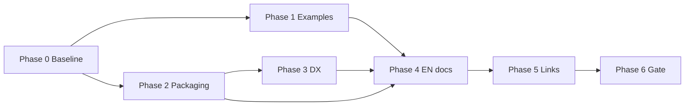

# Visitor Adoption Mitigation Plan

> **For agentic workers:** REQUIRED SUB-SKILL: Use superpowers:subagent-driven-development (recommended) or superpowers:executing-plans to implement this plan task-by-task. Steps use checkbox (`- [ ]`) syntax for tracking.

**Goal:** Remove adoption friction identified in the 2026-07-05 visitor review and make all user-facing documentation English-first, without changing technical specs.

**Architecture:** Six workstreams executed in dependency order — (1) canonical English example + demo alignment, (2) installable package, (3) DX helpers, (4) user-doc translation, (5) content/link hygiene, (6) verification gate. Technical docs (`architecture.md`, `level*.md`, `execution-plan.md`, etc.) remain Spanish; user docs at canonical paths become English.

**Tech Stack:** Python 3.10+, `pyproject.toml` / setuptools, existing `run.py` / MCP / HTTP scripts, Markdown.

**Target release:** `1.0.2` (docs + DX only; no pipeline behaviour change).

---

## Scope

### In scope

| Workstream | Delivers |
|------------|----------|
| A — Example coherence | One canonical EN ACME example across README, demo, JSON examples, quickstart |
| B — Install & packaging | `pip install -e .` without `PYTHONPATH` |
| C — DX scripts | `--quickstart`, MCP config generator, clearer `run.py` help |
| D — User docs EN | README, getting-started, FAQ, examples README, visitor-facing strings |
| E — Content & links | “When not to use”, decision table, badges, no architecture traps |
| F — Gate | Visitor walkthrough + `python run.py --ci` |

### Out of scope

- Rewriting `level1.md`–`level5.md`, `architecture.md`, `ingest.md`, CIR specs
- PyPI publish (optional follow-up enmienda)
- Docker image
- Re-enabling GitHub Actions
- Pipeline / benchmark logic changes

### User-facing files (translate to English)

| File | Action |
|------|--------|
| `README.md` | Rewrite EN (canonical) |
| `docs/getting-started.md` | Rewrite EN |
| `docs/FAQ.md` | Rewrite EN |
| `data/examples/README.md` | Rewrite EN |
| `CHANGELOG.md` | EN for new `1.0.2` section; keep prior entries |
| `data/examples/*.json` | `description` fields → EN |
| `run.py` | `argparse` help + demo headings → EN |
| `scripts/mcp/run_server.py` | Module docstring → EN |
| `scripts/http/run_server.py` | Module docstring → EN |

### Spanish archive (optional, recommended)

| File | Action |
|------|--------|
| `docs/es/README.md` | Copy pre-migration Spanish README (link from EN README footer) |
| `docs/es/getting-started.md` | Copy pre-migration Spanish guide |
| `docs/es/FAQ.md` | Copy pre-migration Spanish FAQ |

Technical docs stay at current paths in Spanish. EN user docs link to them as “Technical reference (ES)”.

---

## Canonical example contract

All visitor touchpoints MUST use the same payload and expected output shape.

**Input blocks (EN):**

```json
{
  "blocks": [
    {"id": "A", "source_type": "rag", "content": "Company: ACME\nJuan works at ACME."},
    {"id": "B", "source_type": "rag", "content": "Company: ACME\nBudget: 50k\nJuan approved the budget."},
    {"id": "C", "source_type": "rag", "content": "Company: ACME\nPedro works at ACME."}
  ],
  "levels": [1, 2],
  "locale": "en"
}
```

**Expected prose output (illustrative — pin exact string in test):**

```
Company: ACME
Juan works at ACME and approved the budget.
Budget: 50k
Pedro works at ACME.
```

**Rules:**

- No `Client: Globex` unless added to input blocks.
- Demo uses `optimize_context(..., levels=[1, 2], locale="en")`, not raw `deduplicate_context`.
- `level1_acme.json` renamed or superseded by `acme_rag_en.json` (keep old file as alias with deprecation note one release).

---

## User-facing vocabulary (replace N-labels in visitor docs)

| `levels` | User label (EN docs) | When |
|----------|----------------------|------|
| `[1]` | Line deduplication | Repeated lines across chunks |
| `[1, 2]` | Dedup + entity grouping | **Default for narrative RAG** |
| `[1, 2, 3, 4]` | + relations & graph slice | Complex multi-entity context |
| includes `5` + `session_id` | Session memory | Multi-turn agents |

Keep `levels` as the API parameter; explain in plain language. Link to `docs/levels.md` as “Technical reference (ES)” only.

---

## Phase 0 — Baseline & branch

### Task 0: Snapshot and branch

**Files:**
- Create: `docs/plans/2026-07-05-visitor-adoption-mitigation.md` (this file)
- Optional: `docs/es/*` snapshots before edits

- [ ] **Step 1:** Run `python run.py --ci` — record PASS baseline (234 tests, 10 smokes).
- [ ] **Step 2:** Create branch `feat/visitor-adoption-1.0.2`.
- [ ] **Step 3:** Copy current Spanish user docs to `docs/es/` before overwriting.

---

## Phase 1 — Example coherence (P0)

**Depends on:** Phase 0  
**Fixes findings:** README ≠ demo, Globex inconsistency, demo shows N1 only

### Task 1: Canonical example file

**Files:**
- Create: `data/examples/acme_rag_en.json`
- Modify: `data/examples/http_optimize_rag.json` (align if needed)
- Modify: `data/examples/mcp_optimize_rag.json` (align if needed)

- [ ] **Step 1:** Add `acme_rag_en.json` with canonical contract above.
- [ ] **Step 2:** Point `http_optimize_rag.json` and `mcp_optimize_rag.json` to identical `blocks` + `levels` + `locale`.

### Task 2: Rewrite `run.py --demo`

**Files:**
- Modify: `run.py`
- Test: `tests/test_run_demo.py` (new)

- [ ] **Step 1: Write failing test**

```python
# tests/test_run_demo.py
import json
import subprocess
import sys
from pathlib import Path

ROOT = Path(__file__).resolve().parents[1]
EXAMPLE = ROOT / "data" / "examples" / "acme_rag_en.json"


def test_demo_uses_optimize_context_en():
    proc = subprocess.run(
        [sys.executable, str(ROOT / "run.py"), "--demo"],
        cwd=ROOT,
        capture_output=True,
        text=True,
        env={**__import__("os").environ, "PYTHONPATH": str(ROOT / "src")},
    )
    assert proc.returncode == 0, proc.stderr
    assert "Company: ACME" in proc.stdout
    assert "Globex" not in proc.stdout
    data = json.loads(EXAMPLE.read_text(encoding="utf-8"))
    for block in data["blocks"]:
        assert block["content"].split("\n")[0] in proc.stdout or "INPUT" in proc.stdout
```

- [ ] **Step 2:** Run `pytest tests/test_run_demo.py -v` — expect FAIL.

- [ ] **Step 3:** Change `run_demo()` to:
  - Load `acme_rag_en.json`
  - Call `optimize_context(blocks, levels=[1, 2], locale="en")`
  - Print `## Input` / `## Optimized output` / metrics in English

- [ ] **Step 4:** Run test — expect PASS.

- [ ] **Step 5:** Commit `fix: align demo with canonical EN optimize_context example`.

### Task 3: Add `run.py --quickstart`

**Files:**
- Modify: `run.py`
- Test: extend `tests/test_run_demo.py`

- [ ] **Step 1:** Add `--quickstart` flag — same as demo but prints copy-paste Python snippet after output.
- [ ] **Step 2:** Test exit code 0 and snippet contains `from coe import optimize_context`.
- [ ] **Step 3:** Commit `feat: add run.py --quickstart for integrators`.

---

## Phase 2 — Install & packaging (P0)

**Depends on:** Phase 0  
**Fixes findings:** `PYTHONPATH=src` required, no pip install

### Task 4: Add `pyproject.toml`

**Files:**
- Create: `pyproject.toml`
- Modify: `README.md`, `docs/getting-started.md` (install section — Phase 4)

- [ ] **Step 1:** Create minimal package metadata:

```toml
[build-system]
requires = ["setuptools>=68"]
build-backend = "setuptools.build_meta"

[project]
name = "context-optimization-engine"
version = "1.0.2"
description = "Context optimization for LLM pipelines (RAG, agents, tools)"
readme = "README.md"
license = { text = "MIT" }
requires-python = ">=3.10"
dependencies = [
    "pyyaml>=6.0",
    "jsonschema>=4.0",
    "langdetect>=1.0.9",
]

[project.optional-dependencies]
mcp = ["mcp>=1.0"]
http = ["fastapi>=0.115", "uvicorn>=0.32"]
dev = ["pytest>=8.0"]

[tool.setuptools.packages.find]
where = ["src"]

[project.scripts]
coe-demo = "coe.cli:main"
```

- [ ] **Step 2:** Split `requirements.txt` — base matches `[project]dependencies`; document optional extras.
- [ ] **Step 3:** Add `src/coe/cli.py` with `main()` delegating to `run.py` logic or import from root (thin wrapper).

### Task 5: Verify editable install

**Files:**
- Test: `tests/test_packaging.py` (new)

- [ ] **Step 1:**

```python
# tests/test_packaging.py — smoke import without PYTHONPATH in subprocess
import subprocess
import sys

def test_import_after_editable_install():
    # Run in subprocess with only site-packages; skip if not installed
    proc = subprocess.run(
        [sys.executable, "-c", "from coe import optimize_context; print('ok')"],
        capture_output=True,
        text=True,
    )
    assert proc.returncode == 0, proc.stderr
    assert "ok" in proc.stdout
```

- [ ] **Step 2:** Document in README: `pip install -e ".[dev]"` replaces `export PYTHONPATH=src`.
- [ ] **Step 3:** Keep `export PYTHONPATH=src` as fallback one-liner for clone-without-install.
- [ ] **Step 4:** Commit `feat: add pyproject.toml for pip editable install`.

---

## Phase 3 — DX helpers (P1)

**Depends on:** Phase 2 (optional paths)  
**Fixes findings:** MCP absolute paths, maintainer flags in default help

### Task 6: MCP config generator

**Files:**
- Create: `scripts/mcp/print_cursor_config.py`
- Modify: `docs/getting-started.md` (Phase 4)

- [ ] **Step 1:** Script prints JSON to stdout:

```python
#!/usr/bin/env python3
import json
import sys
from pathlib import Path

ROOT = Path(__file__).resolve().parents[2]
py = ROOT / ".venv" / "bin" / "python"
if not py.exists():
    py = Path(sys.executable)
print(json.dumps({
    "mcpServers": {
        "coe": {
            "command": str(py.resolve()),
            "args": [str((ROOT / "scripts/mcp/run_server.py").resolve())],
            "env": {},
        }
    }
}, indent=2))
```

- [ ] **Step 2:** Document: `python scripts/mcp/print_cursor_config.py > .cursor/mcp.json`
- [ ] **Step 3:** Commit `feat: add MCP Cursor config generator`.

### Task 7: Tidy `run.py` help

**Files:**
- Modify: `run.py`

- [ ] **Step 1:** Group argparse: visitor flags (`--demo`, `--quickstart`) first; maintainer flags in `parents` subparser or suffix `(maintainer)`.
- [ ] **Step 2:** Default `python run.py` prints short visitor help + “Run with --help-all for maintainer commands”.
- [ ] **Step 3:** Commit `chore: separate visitor vs maintainer run.py flags`.

### Task 8: Install matrix in getting-started

**Files:**
- Modify: `docs/getting-started.md` (EN, Phase 4)

| I want… | Install |
|---------|---------|
| Try demo / Python library | `pip install -e ".[dev]"` |
| MCP server | `pip install -e ".[mcp]"` |
| HTTP API | `pip install -e ".[http]"` |
| Everything local | `pip install -e ".[dev,mcp,http]"` |

---

## Phase 4 — User documentation English (P0)

**Depends on:** Phases 1–3 content stable  
**Fixes findings:** mixed ES/EN, jargon, missing “when not to use”

### Task 9: README.md (EN)

**Files:**
- Modify: `README.md`

**Structure (top → bottom):**

1. One-line value prop + diagram
2. Badges row: MIT, Python 3.10+, tests count, version `1.0.2`
3. **Try it now** — `pip install -e ".[dev]"` + `python run.py --demo`
4. Before/after (canonical EN example, fixed Globex)
5. Three integration paths table
6. **Choosing options** — user vocabulary table (no N1/N2 labels in prose)
7. **When not to use COE** — 4 bullets (already minimal context, tabular-only payloads, need generative summary, sub-200-token context)
8. Documentation table — EN user docs + “Technical reference (ES)” links
9. PCM + COE one paragraph
10. Footer: `docs/es/` link for Spanish user docs

- [ ] **Step 1:** Draft EN README per structure.
- [ ] **Step 2:** Self-review against canonical example contract.
- [ ] **Step 3:** Commit `docs: English README with adoption-focused structure`.

### Task 10: docs/getting-started.md (EN)

**Files:**
- Modify: `docs/getting-started.md`

**Rules:**

- Title: “Getting started — integrate COE without reading the pipeline”
- Remove “Fase 11” / `execution-plan` from PCM section → link PCM repo only
- HTTP detail: inline minimal curl; link `architecture.md` as “API schema (ES)” not primary path
- Add **Decision guide** section (mermaid flowchart):
  - One-shot RAG → `[1, 2]`
  - Multi-turn agent → `5` + `session_id`
  - Mixed languages → `l0` + `target_lang`
  - Code / JSON / glossary → `source_type` + link `ingest.md (ES)`
- Install matrix from Task 8 at top

- [ ] **Step 1:** Translate and restructure per rules.
- [ ] **Step 2:** Commit `docs: English getting-started with decision guide`.

### Task 11: docs/FAQ.md (EN)

**Files:**
- Modify: `docs/FAQ.md`

**Add questions:**

- When should I **not** use COE?
- What savings should I expect? (point to smoke benchmarks: typical 15–40% on narrative RAG; not a guarantee)
- Do I need MCP in `requirements.txt` for library-only use? (no — use extras)

**Keep existing 8+ questions**, reworded without requiring N-label understanding.

- [ ] **Step 1:** Translate + add new entries.
- [ ] **Step 2:** Commit `docs: English FAQ with adoption Q&A`.

### Task 12: data/examples/README.md + JSON descriptions (EN)

**Files:**
- Modify: `data/examples/README.md`, all `data/examples/*.json`

- [ ] **Step 1:** Translate table and file descriptions.
- [ ] **Step 2:** Update `level1_acme.json` → deprecate in README; primary = `acme_rag_en.json`.
- [ ] **Step 3:** Commit `docs: English examples index and descriptions`.

### Task 13: CLI strings (EN)

**Files:**
- Modify: `run.py`, `scripts/mcp/run_server.py`, `scripts/http/run_server.py`

- [ ] **Step 1:** Translate argparse help and docstrings.
- [ ] **Step 2:** Commit `chore: English CLI help strings`.

### Task 14: Spanish archive

**Files:**
- Create: `docs/es/README.md`, `docs/es/getting-started.md`, `docs/es/FAQ.md`

- [ ] **Step 1:** Place pre-migration Spanish copies (from Task 0).
- [ ] **Step 2:** Add banner at top: “Legacy Spanish user docs — canonical docs are English at repo root.”
- [ ] **Step 3:** Commit `docs: archive Spanish user docs under docs/es/`.

---

## Phase 5 — Link hygiene & trust signals (P1)

**Depends on:** Phase 4  
**Fixes findings:** architecture traps, weak trust signals, PCM phase refs

### Task 15: Cross-link cleanup

**Files:**
- Modify: `docs/vision.md` (intro only)
- Modify: `docs/architecture.md` (§7 pointers)
- Modify: `docs/STATUS.md` (one line at top)

- [ ] **Step 1:** `vision.md` — add at top: “For integration start at [getting-started.md](getting-started.md) (EN).”
- [ ] **Step 2:** `architecture.md` §7 — replace “see §7.3 for detail” in getting-started with “schema reference”; getting-started stays self-contained.
- [ ] **Step 3:** `STATUS.md` — label clearly “Maintainers (ES)” in first heading.
- [ ] **Step 4:** Commit `docs: route visitors to EN guides from technical docs`.

### Task 16: README badges

**Files:**
- Modify: `README.md`

```markdown
[](LICENSE)
[](https://www.python.org/downloads/)
[](#try-it-now)
[](CHANGELOG.md)
```

- [ ] **Step 1:** Add badges (no CI badge — Actions disabled; honest “run locally” note in FAQ).
- [ ] **Step 2:** Commit `docs: add README trust badges`.

### Task 17: CHANGELOG 1.0.2

**Files:**
- Modify: `CHANGELOG.md`

- [ ] **Step 1:** Add `## [1.0.2] — 2026-07-05` section listing adoption mitigations.
- [ ] **Step 2:** Bump `pyproject.toml` version if not already `1.0.2`.
- [ ] **Step 3:** Commit `chore: release notes 1.0.2`.

### Task 18: execution-plan enmienda

**Files:**
- Modify: `docs/execution-plan.md`

- [ ] **Step 1:** Add **Fase 21 — Visitor adoption mitigation (EN)** with checklist mirroring this plan.
- [ ] **Step 2:** Mark PyPI/Docker as optional Fase 22.
- [ ] **Step 3:** Commit `docs: add Fase 21 adoption mitigation to execution plan`.

---

## Phase 6 — Verification gate (P0)

**Depends on:** All phases

### Task 19: Automated gate

- [ ] **Step 1:** `pip install -e ".[dev,mcp,http]"`
- [ ] **Step 2:** `python run.py --ci` — PASS (234 tests, 10 smokes).
- [ ] **Step 3:** `pytest tests/test_run_demo.py tests/test_packaging.py -v` — PASS.

### Task 20: Manual visitor walkthrough (<15 min)

Checklist for reviewer acting as “clean visitor”:

| Step | Action | Pass criteria |
|------|--------|---------------|
| 1 | Read README only (first screen) | Understands what COE does without N-labels |
| 2 | `pip install -e ".[dev]"` + `python run.py --demo` | Output matches README before/after |
| 3 | `python run.py --quickstart` | Copy-paste snippet runs without PYTHONPATH |
| 4 | `pip install -e ".[http]"` + start HTTP + curl example JSON | 200 + prose output |
| 5 | `python scripts/mcp/print_cursor_config.py` | Valid JSON with absolute paths |
| 6 | Read FAQ “when not to use” | Can decide fit without architecture.md |
| 7 | Click doc links from README | No dead ends; technical docs labelled ES |

- [ ] **Step 1:** Record walkthrough date + reviewer in `docs/plans/2026-07-05-visitor-adoption-mitigation.md` (Gate section below).
- [ ] **Step 2:** Fix any FAIL before merge.

---

## Execution order & parallelism



| Phase | Priority | Est. effort | Can parallelise with |
|-------|----------|-------------|----------------------|
| 0 | P0 | 30 min | — |
| 1 | P0 | 2 h | 2 (after 0) |
| 2 | P0 | 2 h | 1 |
| 3 | P1 | 1.5 h | 4 (partial) |
| 4 | P0 | 4 h | 3 |
| 5 | P1 | 1 h | — |
| 6 | P0 | 1 h | — |

**Total:** ~12 h focused work (1–2 sessions).

---

## Risk register

| Risk | Mitigation |
|------|------------|
| Demo output string drifts with renderer changes | Pin assertion on key lines, not full string; run in CI |
| `pip install -e .` breaks MCP path assumptions | MCP script keeps `sys.path` injection; test both paths |
| Spanish-speaking users lose primary docs | `docs/es/` archive + footer link |
| Technical doc links break after EN rename | Paths unchanged; only content language changes |
| Translating examples breaks benchmark fixtures | Benchmark inputs are separate under `data/benchmarks/` — do not change |

---

## Success metrics (post-merge)

| Metric | Before | Target |
|--------|--------|--------|
| Import without PYTHONPATH | Fail | Pass via `pip install -e .` |
| README vs demo consistency | Low | Identical example |
| Visitor doc language | Mixed ES/EN | EN canonical |
| N-label mentions in user docs (prose) | Many | Zero (API param only) |
| Time clone → working demo | ~5 min + confusion | <5 min clear |
| architecture.md clicks from getting-started | Required for HTTP | Optional ES reference |

---

## Gate log

| Date | Reviewer | `run.py --ci` | Visitor walkthrough | Notes |
|------|----------|---------------|---------------------|-------|
| 2026-07-05 | agent | PASS (238 tests, 10 smokes) | demo + quickstart + packaging tests PASS | HTTP/MCP manual walkthrough pending |

---

## Commit sequence (suggested)

1. `chore: snapshot Spanish user docs to docs/es/`
2. `fix: canonical EN ACME example and demo via optimize_context`
3. `feat: add run.py --quickstart`
4. `feat: add pyproject.toml for editable install`
5. `feat: add MCP Cursor config generator`
6. `chore: visitor vs maintainer run.py help`
7. `docs: English README, getting-started, FAQ, examples`
8. `docs: link hygiene and README badges`
9. `chore: CHANGELOG 1.0.2 and execution-plan Fase 21`
